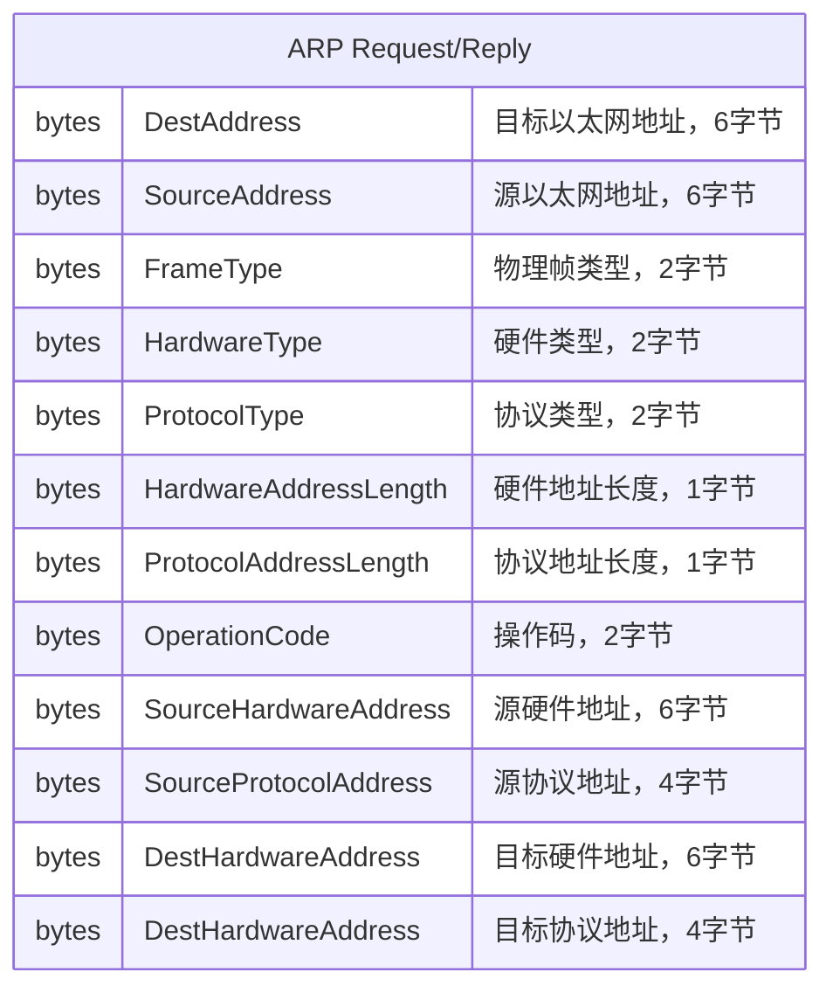
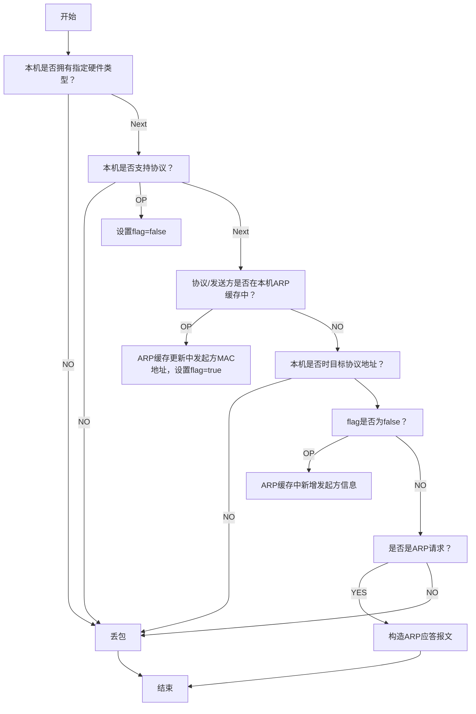

地址解析协议（Address Resolution Protocol, ARP）协议是与物理网络相关的标准协议，它负责把上层协议地址（IP地址）转换成物理网络地址。RARP协议和ARP协议相反，把物理网络地址转换成上层协议地址（IP地址）。

## ARP协议

在单个物理网络中，每个主机通过物理硬件地址和网络中的其它地址通信。上层协议地址是以一种符号地址被记录的（IP地址）。当主机想向另一个IP地址是w.x.y.z的主机发送IP数据报时，网卡驱动器不理解这个地址的含义。

因此，物理网络层提供了ARP模块来将IP地址翻译成物理网络地址，ARP模块使用一个查询表（也叫ARP缓存）来进行这个翻译操作。当IP地址在ARP缓存中不存在时，ARP模块就会发送一个ARP请求的广播。如果网络中某一个主机的IP地址和ARP请求中的IP地址相同，它就会发送ARP应答给ARP请求发起主机，ARP应答中包含发送方主机的物理地址和源路由信息（如果报文跨越了网桥）。发起主机会把目标主机的物理地址和路由信息存储在ARP缓存中，接下来的所有到该目标主机的数据报就可以转换成物理地址，网卡驱动器就可以发送IP数据报了。

> 一个例外的情况就是异步传输模式（Asynchronous Transfer Mode, ATM），ARP请求不能像上述过程一样被实现。因此ATM网络中的主机在初始化的时候必须显式注册ARP服务器来解析IP地址到物理地址。

ARP协议定义在RFC 826中，它仅仅描述了ARP协议的功能，并没有定义它的实现。它的实现很大程度上依赖对特定网络类型的网卡驱动，功能一般集成在网卡微代码中。

### ARP协议报文

当应用程序想向特定IP地址发送数据时，IP路由机制首先就会决定报文的下一跳IP地址和需要使用哪个网卡来发送数据。ARP模块试图从ARP缓存中查询下一跳对应的48位物理地址（MAC地址），如果ARP缓存中没找到，它会丢掉报文（它假设上层协议会重新传输）然后生成ARP请求报文并在网络中进行广播。

ARP报文的格式如下：

协议类型取值为IP或ARP

操作码取值为：

- 1 ARP请求
- 2 ARP应答

源协议/目标协议地址，当使用TCP/IP协议的时候，它们就是IPV4/IPV6地址。

### ARP报文处理流程

ARP请求发起主机接收到ARP应答后，执行相同的处理逻辑，因此目标主机的地址信息会被更新到ARP缓存中。上层协议发送数据报的时候，ARP模块就会知道目标主机的物理地址并发出数据报。

### Proxy-ARP

当网络进行了子网划分时，ARP协议处理逻辑不变，因为每个IP数据报首先要经过IP路由算法，路由算法选择使用哪个网卡发送报文，此后ARP模块和网卡驱动的MAC地址开始关联。

Proxy-ARP协议是构建子网划分的另一种方法，它通过修改路由器的路由算法来避免修改原始的IP路由算法，主机不需要识别子网划分。

当一个物理网络划分了不同子网之后，不同子网中的主机不需要知道子网划分的存在，它们之间的跨子网通信流程如下图所示：

上述过程过程就是透明子网划分：

- 普通主机（A/B）不知道子网的存在，它们仍然仅使用网络编号进行路由
- 子网之间的路由器必须支持：
    - 子网划分路由算法
    - ARP模块需要修改，需要可以代替其它主机应答跨子网ARP请求

## RARP协议

逆地址解析协议（Reverse Address Resolution Protocol，RARP）是一种网络相关的协议，被被用来将MAC地址转换成IP地址。

有些主机，比如无盘工作站，当启动时不知道自己的IP地址。为了确定自己的IP地址，它们使用一种和ARP协议类似的协议，不过主机MAC地址作为已知参数，IP地址作为查询参数。它和ARP协议的根本区别是RARP服务器必须在网络中存在，并要提前配置一个保存了物理地址和协议地址映射的数据库。

RARP查询和ARP查询工作方法相同，它们的报文格式也相同，报文中使用了不同的操作代码：

- 3 RARP请求
- 4 RARP应答

此外，RARP报文的物理帧类型是0x8035，ARP是0x0806。

它们概念上的不同导致了以下特性：

- ARP协议仅假设每个主机都知道自己的物理地址和协议地址，RARP协议需要一个或多个主机维护物理地址和协议地址的数据库
- 因为RARP的数据库可能很大，RARP服务器的部分功能通常由网卡微代码意外的其它进程实现，网卡驱动负责接收和传输RARP帧
- RARP数据库由其它软件手动创建和更新
- 网络中可能存在多个RARP服务器，RARP请求发起方仅使用第一个RARP应答并会丢掉其它的应答