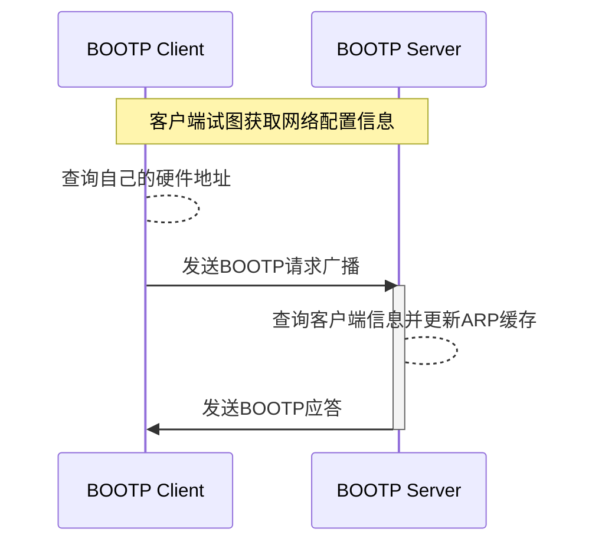
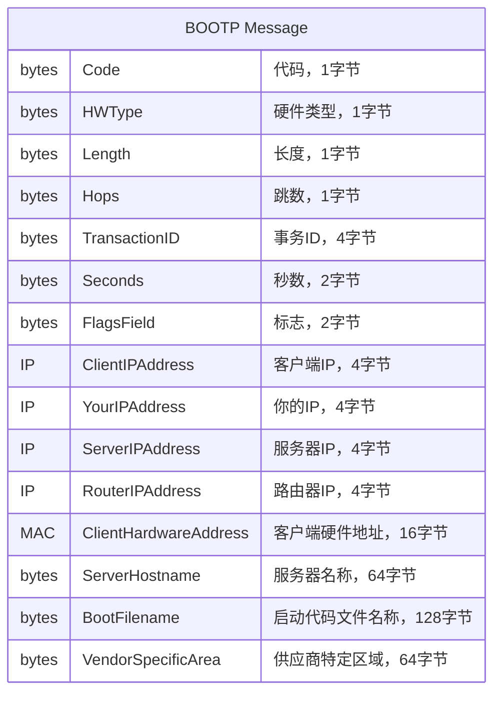
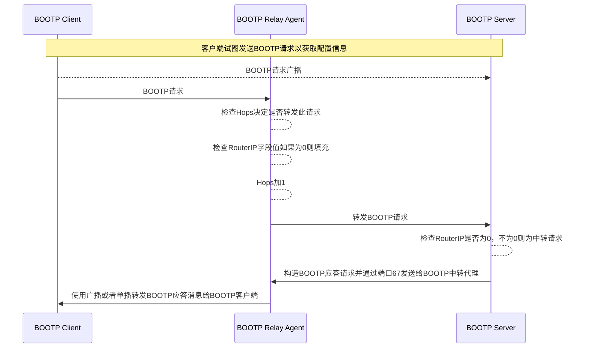

## BOOTP协议简介

Bootstrap Protocol(BOOTP协议)可以让客户端工作站初始化时仅需要一个最小的IP实现，客户端从BOOTP服务器去获取它的IP地址、网关地址和命名服务器地址。一般来说，BOOTP客户端和服务器需要在同一个网络中，如果需要跨子网，则需要支持BOOTP转发的路由器。

BOOTP最早是用来支持无盘主机通过网络远程启动作为工作站、路由器和终端的。它仅需要一个最小的、没有配置信息的IP实现，通过这个精简IP实现去获取足够的信息并开始下载启动代码。BOOTP协议没有定义如何完成下载启动代码，不过通常都是使用简单文件传输协议（Trivial File Transfer Protocol, TFTP）。虽然BOOTP主要用于无盘主机，它也被当作一种给没有手动配置网络信息的主机分发配置的机制。

## BOOTP处理流程

如上图所示，BOOTP协议的处理流程如下：

- 客户端判定自己的物理地址，通常是写在硬件的ROM中，比如MAC地址
- BOOTP客户端使用UDP数据报发送自己的硬件地址给BOOT服务器
    - 如果客户端知道自己的IP地址，报文中要填上它，一般情况下客户端不知道自己的IP地址，填写0.0.0.0
    - 如果客户端不知道服务器地址，就使用受限广播地址255.255.255.255，UDP端口使用67
- BOOTP服务器接收到数据报并在配置文件中查询客户端地址，把客户端相关配置信息写入数据报中并通过UDP端口68发送给客户端
    - 如果客户端知道自己的IP地址并在请求中填写了，服务器就直接返回给客户端
    - 如果客户端不知道自己的IP地址并在请求中填写0.0.0.0，此时服务器需要关心自己的ARP缓存信息
    - 服务器上的ARP协议不能被用来查询客户端的IP地址，因为客户端还不知道自己的IP地址因此不能正确回应ARP请求，这是一个“鸡和蛋”的问题，一般有两种解决办法：
        - 服务器提供机制不通过ARP自生直接更新自己的ARP缓存，然后直接发送响应数据报
        - 服务器不能更新自己的ARP缓存，它必须发送一个广播应答
- BOOPT客户端收到请求应答，客户端会记录自己的IP地址（此后它就可以正常应答ARP请求），然后就可以开始启动过程

### BOOTP消息格式

Code用于标识是BOOTP请求还是应答：

- 0 请求
- 1 应答

HWType用于标识硬件类型，比如：

- 0 以太网
- 6 IEEE 802网络

Length 用于标识硬件地址长度，比如以太网和令牌环网络都使用6字节

Hops 用于标识数据报经历的设备跳数，BOOTP客户端会把它设置成0，中转该数据报的路由器会对它进行加1，这个标识是用来检测循环的。RFC 951建议当跳数达到3时就表明存在循环。

TransactionID 一个用来匹配BOOTP请求的和应答的随机数

Seconds 由客户端设置的，含义是开始从客户端开始启动过程经历的秒数

FlagsField 最高位用来标识请求是广播请求。其它位必须设置成0，它们被保留作将来使用。通常BOOTP服务器会试图通过单播来传输BOOTP应答消息给客户端，目标地址是BOOTP消息中`YourIPAddress`的值，消息中的MAC地址被设置成BOOTP请求消息中的客户端硬件地址。如果主机直到自己知道自己的IP地址之后才能接收到单播IP数据报，这个广播标识位必须被设置成1来指示BOOTP服务器必须通过IP和MAC地址广播来发送BOOTP应答消息。否则，这个标识位必须被设置成0。

ClientIPAddress 由客户端设置，要么是自己的IP地址，要么是0.0.0.0

YourIPAddress 由服务器设置，如果客户端IP地址字段值为0.0.0.0

ServerIPAddress 由服务器设置

RouterIPAddress BOOTP中转代理的IP地址，不是普通的路由器IP地址，当BOOTP转发请求时由转发代理设置

ClientHardwareAddress 由客户端设置，服务器会通过它来判定哪个客户端在启动

ServerHostname 可选的服务器主机名称，以0x00结尾

BootFilename 客户端要么让这个值保持Null，要么定义一个通用名称，比如要使用的路由器启动代码类型，服务器返回适合该客户端的启动代码的完全限定名称（Fully Qualified Name），以0x00结尾

VenderSpecificName 可选供应商特定区域，客户端应该总是在前4个字节填充魔法数字。如果没有使用魔法数字，客户端应该使用99.130.83.99并紧接着填写255这个数字，剩余字节填充0。此字段也可以包含BOOTP供应商异常。这些信息可以在和IP地址一起传送给正在启动的客户端。比如，客户端可以接收默认路由器地址，域名服务器地址或者子网掩码。BOOTP和DHCP(Dynamic Host Configuration Protocol)共享相同的选项，除了DHCP有一些DHCP特定的选项。

BOOTP客户端处理了BOOTP应答之后，它就可以开始下载启动代码并执行整个启动流程。一般来说客户端使用简单文件传输协议（Trivial File Transfer Protocol, TFTP）来下载启动代码。对于无盘主机来说，整个启动过程通常会使用BOOTP和TFTP协议，把从ROM中加载的最小IP协议栈替换为启动代码中包括的正常的IP协议栈和正确的客户端配置信息。

## BOOTP转发

BOOTP客户端使用受限广播地址来发送BOOTP请求，它需要BOOTP服务器和客户端在同一个子网内。BOOTP转发（BOOTP Forwarding）是一种让路由器跨子网转发BOOTP请求的机制。大多数路由器都支持此选项，支持BOOTP请求转发的路由器又被叫做BOOTP中转代理。

一般情况下路由器会丢掉任何包含非法源地址的数据报，比如0.0.0.0，BOOTP客户端就使用了这个地址，路由器一般也会丢掉目标地址是受限广播地址的数据报。然而，BOOTP中转代理会在端口67上接受BOOTP客户端发送的上述类型的数据报。BOOTP中转代理处理BOOTP请求的流程如下：

- 检查BOOTP请求的Hops值是否达到阈值来决定否转发此请求，这个阈值一般是可配置的
- 如果中转代理决定转发此请求，则检查消息中RouterIP值是否为0，如果值为0，则填充为接收到此请求的网卡IP地址，如果值不为0则保持不变
- 对Hops值加1
- 转发BOOTP请求给一个或多个BOOTP服务器，这些服务器地址是预先配置好的，通常使用单播帧来转发，有些也使用广播转发
- 当BOOTP服务器收到BOOTP请求时，如果RouterIP值不为0，则通过端口67把BOOTP响应发送给RouterIP对应的中转代理
- 当BOOTP中转代理收到BOOTP应答时，应答消息中包含硬件类型、长度、客户端硬件地址等足够的数据链路层信息，中转代理会把应答转发给客户端。中转代理会检查广播位是否设置，如果设置了它就通过广播来转发应答消息，否则就用YourIPAddress字段对应的IP地址通过单播来转发BOOTP应答消息

当路由器被设置成BOOTP中转代理的时候，BOOTP转发任务和路由器在子网之间转发数据报明显不同。转发BOOTP消息可以被认为路由器作为接收BOOTP消息的最终目的地址并生成新的BOOTP消息发送给其它目的地址。

## BOOTP的优劣

BOOTP协议允许对多个主机进行集中化配置，然而它需要为每个连接到网络中的主机预先配置IP地址，即使客户端很少在线，这意味着被分配的IP地址不能回收。使用BOOTP协议也算是一种安全措施，因为BOOTP服务器只有在客户端拥有合法MAC地址的时候才给客户端分配IP地址。

> BOOTP协议作为DHCP协议的前身，尽管已经被DHCP协议所替代了，然而BOOTP的基本概念和设计仍然在现代网络配置中留下了重要的遗产。

## 参考

- [BOOTP](https://zh.wikipedia.org/zh-cn/BOOTP)
- [TFTP](https://zh.wikipedia.org/zh-cn/%E7%AE%80%E5%8D%95%E6%96%87%E4%BB%B6%E4%BC%A0%E8%BE%93%E5%8D%8F%E8%AE%AE)
- ChatGPT