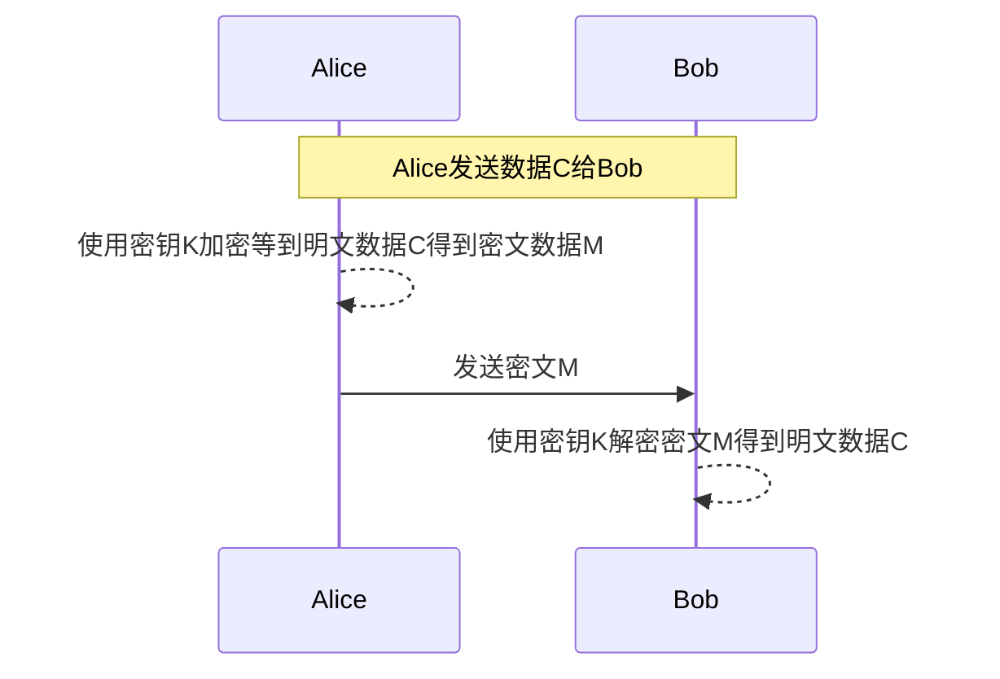
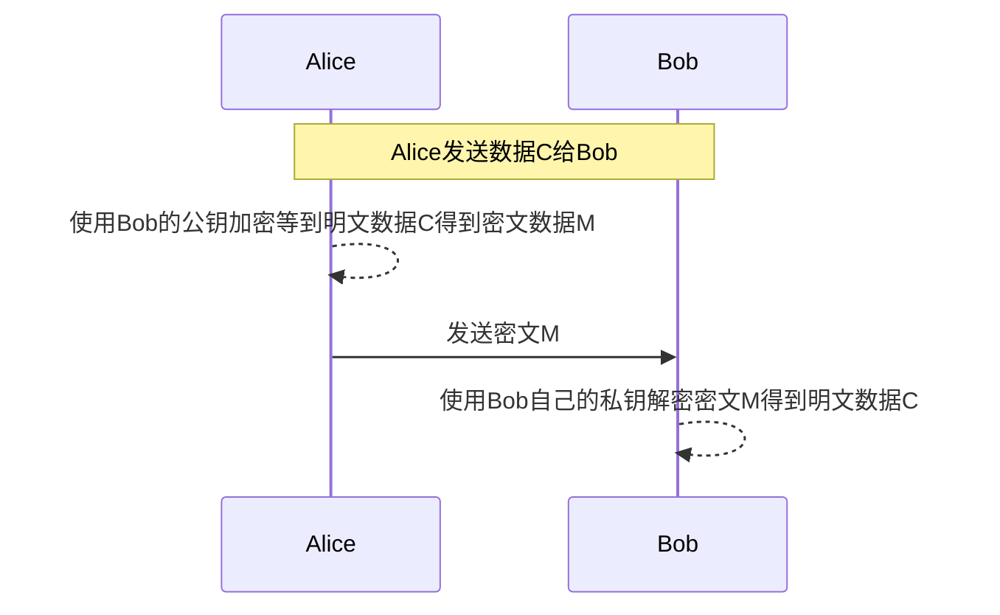
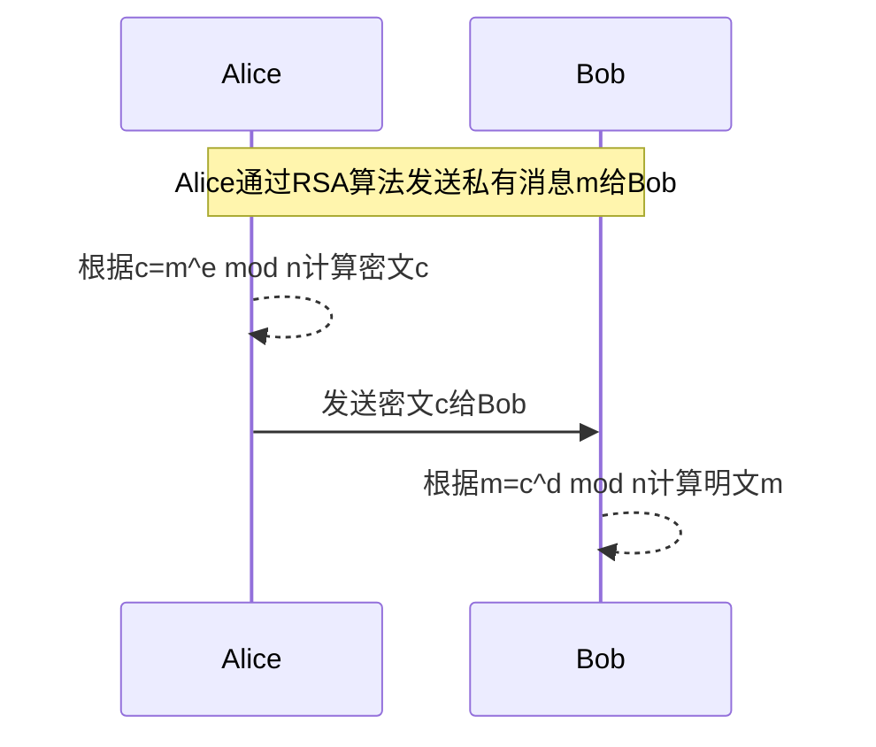
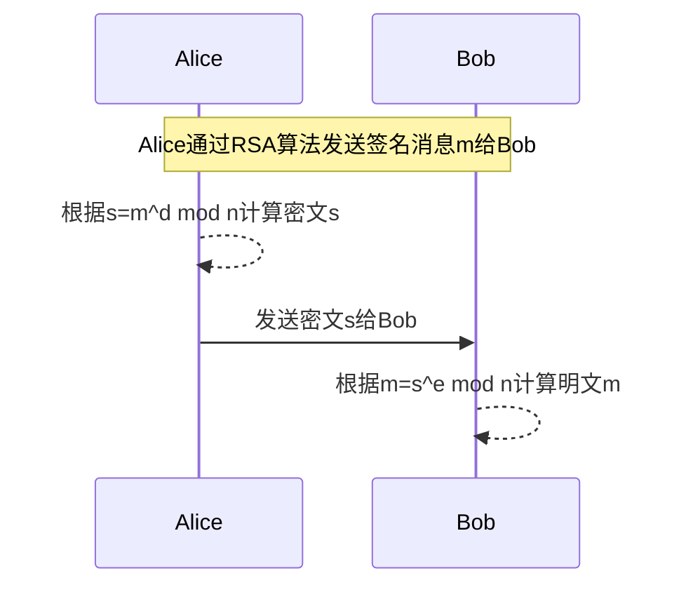
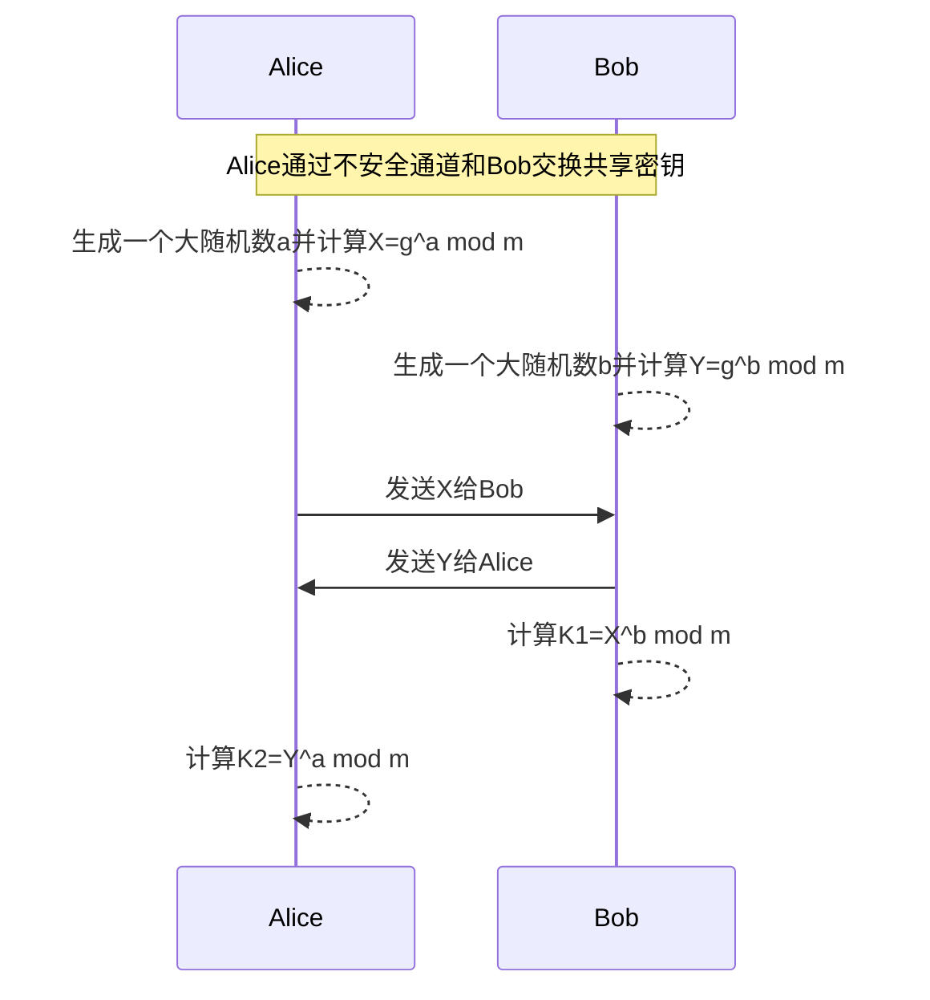

## 网络安全问题

常见的攻击手法：

- 报文嗅探
- 身份冒充
- 拒绝服务攻击
- 消息重放
- 密码破解
- 密钥猜测
- 病毒
- 端口扫描

常见的解决方案：

- 加密 保护数据和密码
- 通过电子签名和证书认证 验证发送方身份
- 授权 组织不合理的访问
- 完整性检查和消息认证码 防止消息篡改
- 不可否认 组织发送方否认自己发送消息

## 密码学

密码学是为了保持数据和数据传输安全而修改数据外表的学科。为了达到这个目标，加密、解密和认证等技术会被使用到。

### 加密

加密通过把明文消息转换成不可读格式来隐藏它的含义。相反的转换，获取原始明文就是解密。加密和解密所用的数学函数被叫做加密算法或者密码（cipher）。

密码的安全性完全基于将其功能保存为一个秘密（secret），这种情况称为受限密码。当这种算法被很多人使用时，被逆向只是时间和成本问题。所以当前使用的算法是基于密钥的，也就是说加密和解密使用一个参数，成为密钥（key）。密钥可以从一个集合中选择，这个集合称为密钥空间（keyspace），密钥空间通常非常大，而且越大越好。这类算法的安全性完全取决于密钥而不是内部机密。通常这类算法是公开的并且被广泛分析其安全弱点。

密钥加密和解密流程图

> 加密文献中常把第一个和第二个参与者分别表示成Alice和Bob，它们被称为加密夫妇。

### 对称加密

对称算法是一种基于密钥的算法，解密时密钥和加密的密钥相同。在安全通信前发送和接收双方必须协商好密钥。对称加密主要有两类：块算法和流算法。块算法把明文分割成比特块然后操作，流算法根据比特或者字节进行操作。

块算法主要有：

- DES(Data Encryption Standard，数据加密标准)，使用56位固定长度密钥，容易被破解，衍生出3DES算法，使用三轮加密
- AES(Advanced Encryption Standard，先进加密标准)，密钥长度可以设置为128/192/256

对称加密算法的优势是它们加密效率高，很容易使用硬件实现。它们的一个主要缺点就是密钥管理困难，必须要有安全的密钥交换方法，通常这比较难以实现。

### 非对称加密

非对称加密算法主要是为了解决对称加密算法的主要缺点，即需要安全的密钥交换通道。它需要两个不同的密钥：

- 公钥 所有人可见
- 私钥 持有者自己秘密保存

从公钥中不能推导出私钥的内容。公钥加密得到的密文私钥可以解密，私钥加密的密文公钥可以解密，即它们可以互相解密对方加密后的密文。

公钥加密算法流程图

因为公钥对所有人可见，所以不需要安全密钥交换通道。通信参与方只需要获得对方的公钥即可。

公钥算法还提供了身份认证功能，当使用私钥进行加密时，如果用公钥可以解密，那说明此密文消息是通过对应的私钥加密的。因为私钥只有发送方自己知道，所以发送方的身份就可以确认了。使用私钥加密被用作电子签名。使用私钥加密的消息也不可抵赖，因为只有私钥拥有者才可以用私钥加密。

公钥加密算法的常用场景：

- 加密
- 为对称加密生成共享密钥

最流行的公钥加密算法是RSA算法，它的安全性依赖于分解大数的困难问题，它的公私钥是两个大质数（200位或者更多）的函数。给定公钥和明文，攻击者需要成功分解两个大质数乘积才可以成功攻击。随着计算机算力的提升，通过增加密钥长度就可以保持RSA算法的安全。

另一个公钥算法就是Diffie-Hellman算法（迪菲-赫尔曼密钥交换算法），它支持在非安全通道上安全的交换共享密钥。通信双方交换公开信息，并从公开信息中派生出共享密钥。当信息工不安全通道中传输时窃听者无法从中重建密钥信息。更准确的说，重建在算力上不能实现。此算法的安全性依赖于计算离散对数的困难程度。当共享密钥交换成功后，它可以被用来派生出对称加密所用的密钥。

迪菲-赫尔曼密钥交换算法让安全的派生共享密钥称为可能，但是它不能认证通信方。为了认证，必须使用其他公钥算法，比如RSA。

公钥算法的最大缺点就是它们非常慢并且难以用硬件实现。比如，RSA算法比DES慢10000倍。所以通常公钥算法不用来做大量数据加密，它们主要被用来做密钥交换和认证。

### RSA算法流程

RSA公钥算法流程：

- 选取两个大质数p和q
- 计算大质数乘积n=pq，n被称做模
- 选择一个数字e，e小于n并且保证e和(p-1)(q-1)没有除了1之外的公因子，也就是e不能分解(p-1)(q-1)
- 计算e的模倒数d，使得ed = 1 mod (p-1)(q-1)

e和n被称为公开和私有指数，公钥是(n,e)，私钥是d。p和q需要被秘密保存或者销毁掉。

RSA加密简化流程示例

RSA认证简化流程示例

### DH密钥交换算法

DH密钥交换算法流程，流程开始前Alice和Bob已经共享了两个公开数：模数m和整数g，m是一个大质数

K1=K2=g^ab mod m，这就是共享密钥。当不知道a或者b值的时候，没有人能够生成这个值。这个密钥交换算法的安全性基于逆向双方所做的指数操作极端困难的这一事实。和RSA一样，通过选择更大的初始值可以对抗增强的算力，也就是选择更大的模数m。