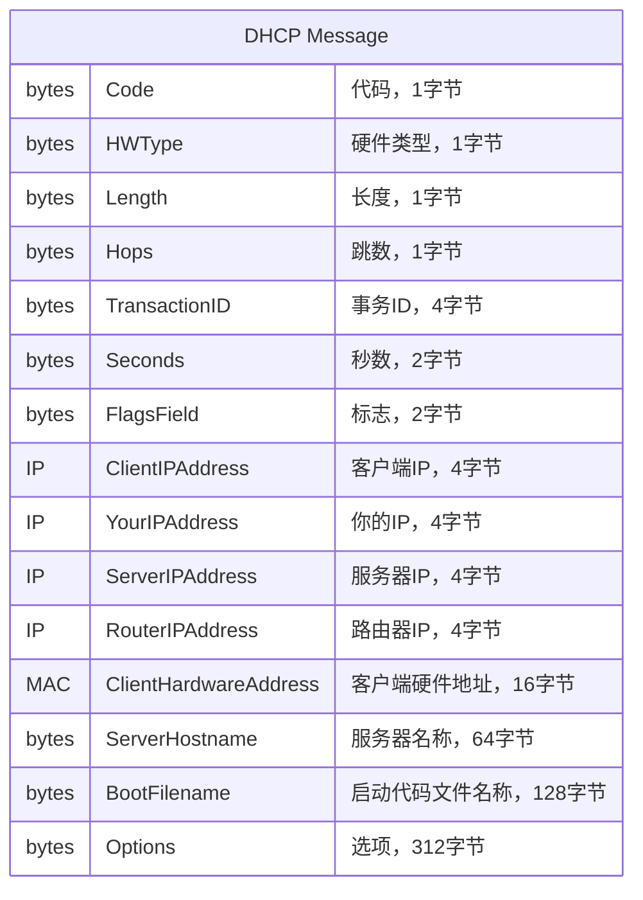
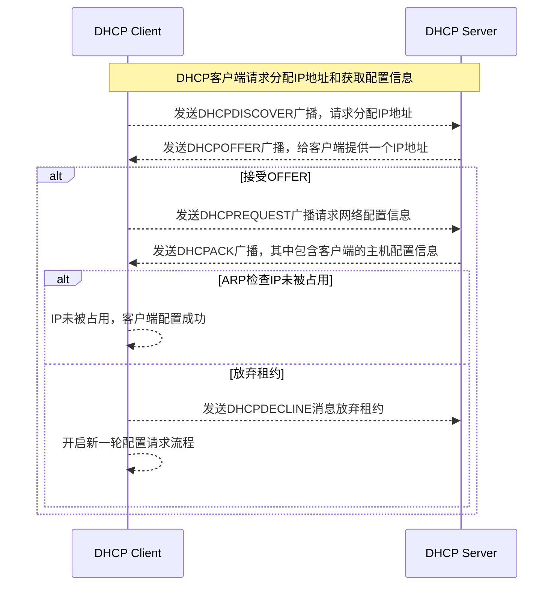
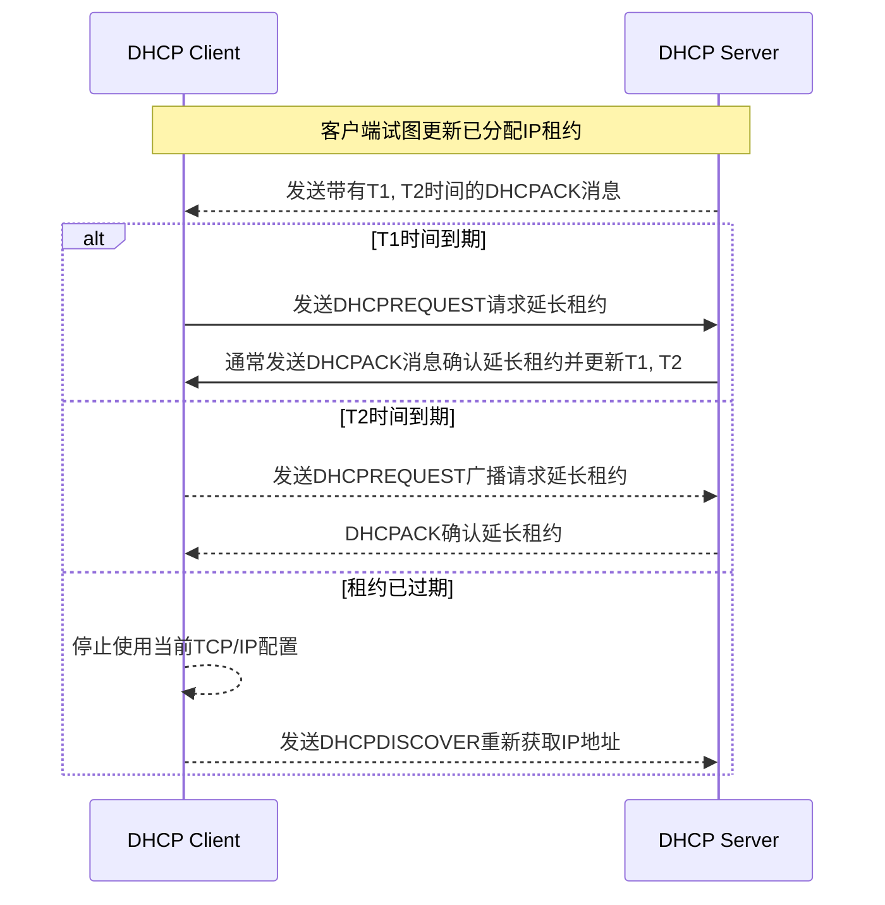

## DHCP简介

动态主机配置协议（Dynamic Host Configuration Protocol, DHCP）提供了一种通过TCP/IP网络向网络中主机传递配置信息的机制。DHCP协议基于BOOTP协议改进，增加了自动分配可重复利用的网络地址和其它配置的能力。

BOOTP协议参考：[BOOTP协议](bootstrap-protocol)

DHCP基于BOOTP发展而来，DHCP和BOOTP使用相同的端口号，服务器使用67，客户端使用68，两种协议之间支持一定的互操作性。

DHCP支持三种IP分配机制：

- 自动分配 DHCP给主机分配一个永久IP地址
- 动态分配 DHCP给主机分配一个时间受限的IP地址，这种地址被称为租约，这是回收已经分配给主机的不再使用的IP地址的唯一方式
- 手动分配 主机IP地址由网络管理员手动分配

## DHCP消息格式

DHCP和BOOTP消息格式基本相同，除了最后一个Options字段，DHCP把长度从BOOTP的64字节增长到了312字节。

DHCP消息有如下类型：

- DHCPDISCOVER 客户端发出的寻找可用DHCP服务器列表请求
- DHCPOFFER DHCP服务器对客户端DHCPDISCOVER消息的应答，消息中包含分配给客户端的IP地址和其它参数
- DHCPREQUEST 客户端给一个或多个DHCP服务器发出的请求消息，主要目的：
    - 从一个DHCP服务器请求已分配IP地址的参数并忽略其它服务器的消息
    - 系统或网络发生变化之后验证之前分配的IP地址，比如机器重启
    - 对特定地址请求延长租约
- DHCPACK 服务器发出的对客户端请求的确认消息，消息中包括主机配置信息
- DHCPNAK 服务器发出的对客户端请求的负面确认信息，表示客户端租约已经过期或者请求的IP地址非法
- DHCPDECLINE 客户端发送给服务器表示分配的IP地址已经被网络中其它主机使用
- DHCPRELEASE 客户端发送给服务器表示放弃剩余租约和已经分配的网络地址
- DHCPINFORM 已经拥有地址的客户端向DHCP服务器请求更多配置参数

## DHCP工作流程

### DHCP分配流程

假设DHCP服务器一段可分配的网络地址并且可以满足客户端的请求，每个服务器维护了一个已分配IP地址和租约的持久到本地的数据库，DHCP客户端和DHCP服务器的交互步骤如下图所示：

如上图所示，DHCP客户端获取IP地址等配置流程可概述为：

- 客户端在本地物理子网上广播DHCPDISCOVER消息，消息中可以包含一些建议的网络地址或租约时长等参数，此时客户端处于INIT状态
- 每个DHCP服务器返回DHCPOFFER消息，其中包含可用网络IP地址信息和一些其它配置选项，如子网掩码/租期/服务器IP，服务器会记录分配的IP地址以免重复分配
- 客户端收到一个或多个DHCPOFFER消息，客户端根据配置信息选择其中一个并广播DHCPREQUEST消息，其中包含服务器ID信息来标识它选择的DHCPOFFER
- 如果客户端没有收到DHCPOFFER消息，且客户端手中有一个租约还没过期的IP地址，则它会继续使用该IP地址
- 服务器收到DHCPREQUEST消息广播，那些没被选择的服务器会认为客户端放弃了租约，被选中的服务器确认客户端硬件地址和分配的IP地址绑定并持久化，响应DHCPACK消息其中包含客户端请求的其它参数，客户端硬件地址和分配的IP地址组成了租约的唯一标志符，客户端和服务器都会使用这个标志符来标识任何后续DHCP消息所引用的租约，DHCPACK消息中的YourIPAddress字段会填充为客户端选择的网络地址
- 客户端收到DHCPACK消息和其它配置参数，客户端会对参数做最终检查，比如使用ARP检查IP地址是否被占用，此时客户端完成配置
- 如果客户端检查出DHCPACK消息存在问题，比如IP地址已经被使用，客户端就会发送DHCPDECLINE广播给服务器来拒绝分配并重启配置过程。为了防止拥塞网络，客户端需要等待最少10秒再重启配置过程。服务器收到DHCPDECLINE消息后，必须把提供的IP标记为不可用并且需要通知系统管理员系统配置出现问题
- 如果客户端收到DHCPNAK消息，客户端会重启配置过程
- 客户端可以给服务器发送DHCPRELEASE消息来放弃租约，消息中附上自己的硬件地址和已经分配的IP地址

### DHCP租约更新

DHCP租约更新流程图如下：

- 当DHCP服务器发送DHCPACK消息给客户端时，消息中带有（T1,T2，T1 < T2）两个时间参数，T1默认为`0.5 * 租约时间`，T2默认为`0,875 * 租约时间`。客户端成功配置IP后，会启动两个定时器T1和T2，此时客户端处于`已绑定`状态
- 当T1定时器到期时，客户端会通过单播发送DHCPREQUEST消息给服务器请求延长租期，客户端会处于`更新中`状态，服务器一般会发送DHCPACK允许延长租约并附上更新的租约时间和时间参数T1和T2，在大多数情况下，一个活跃的客户端可以无限延长租约
- 当T2过期之前客户端仍然没有收到DHCPACK消息时，客户端会进入`重新绑定`状态，它会通过广播发送DHCPREQUEST消息来延长租约，这个请求可以被网络中的任何一个DHCP服务器确认
- 如果租约过期后客户端仍然没有收到DHCPACK消息，它必须停止使用当前的TCP/IP配置，回到`初始`状态，通过广播发送DHCPDISCOVER消息来获取合法地址

### 使用先前分配的地址

如果客户端记住并想重新使用之前分配过的网络地址，需要执行下列步骤：

- 客户端在本地子网中广播DHCPREQUEST消息，消息中包括客户端网络地址
- 如果客户端的租约还没过期，DHCP服务器会发送DHCPACK消息给客户端并更新租约，如果租约已经过期，DHCP服务器会发送DHCPNACK消息
- 客户端收到DHCPACK消息后会执行最终检查，此时客户端配置成功，T1/T2计时器也会被重置
- 如果客户端发现DHCPACK消息参数存在问题，它会发送DHCPDECLINE消息拒绝分配并重启配置过程以获取一个新的网络地址，如果客户端收到DHCPNACK，它就不能使用自己记住的网络地址，它必须通过重启配置过程来获取一个新的网络地址

## DHCP总结

DHCP极大的减少了网络管理员手动配置网络的工作负担，设备在不同网络切换并且可以自动获取正确的配置信息，这对于手机用户来说非常有用。DHCP只有在主机活跃的时候才给它们分配IP地址，或者使用更短的租期来减少需要的IP的数量。不过DHCP也有缺点：

- DHCP依赖UDP构建，UDP不保证网络安全，未授权的客户端也可以连上网络并获取一个合法的IP地址，未授权的DHCP服务器也可以被设置来发送错误和有害的信息给客户端
- 因为DHCP是动态分配，所以在不能提前确定某个IP对应的主机是哪一个，比如在使用静态DNS服务器就会出现问题，解决办法就是让管理员手动分配IP地址给那些需要设置域名的主机