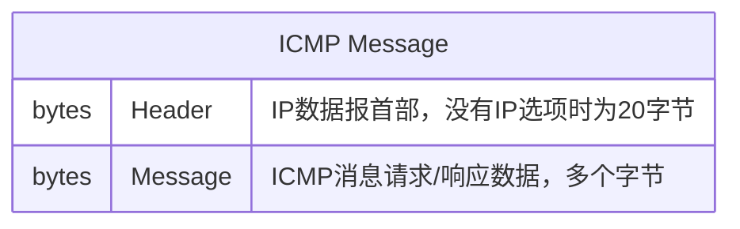
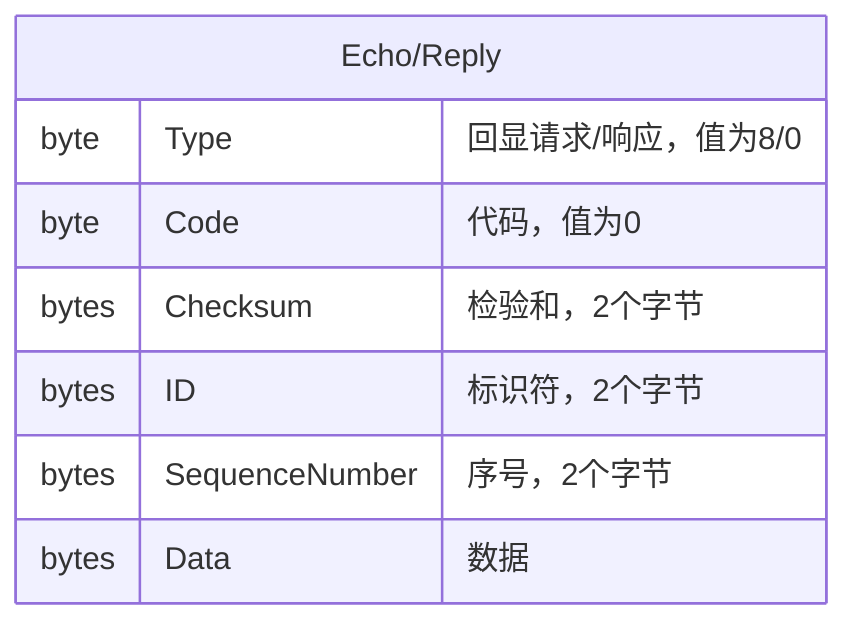
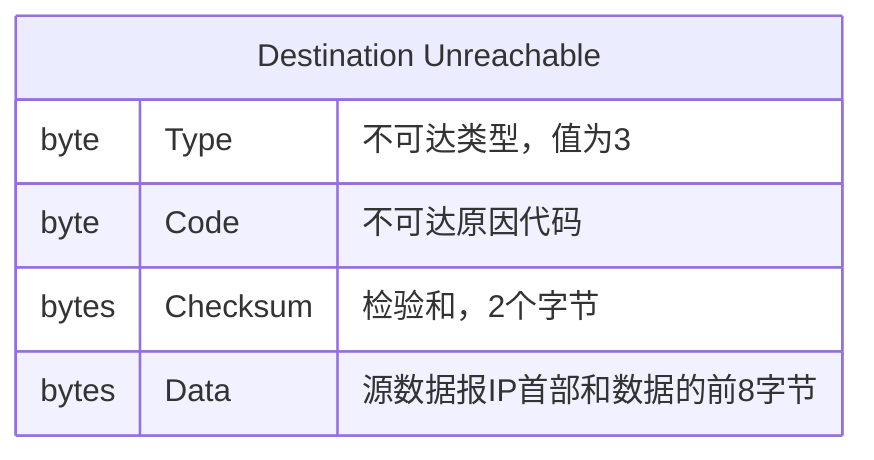
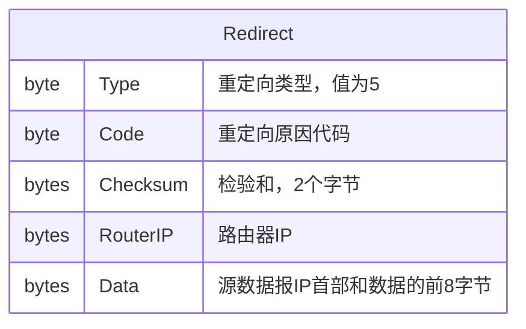
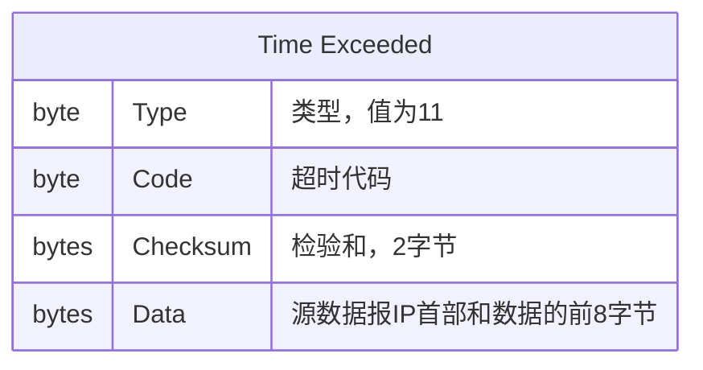
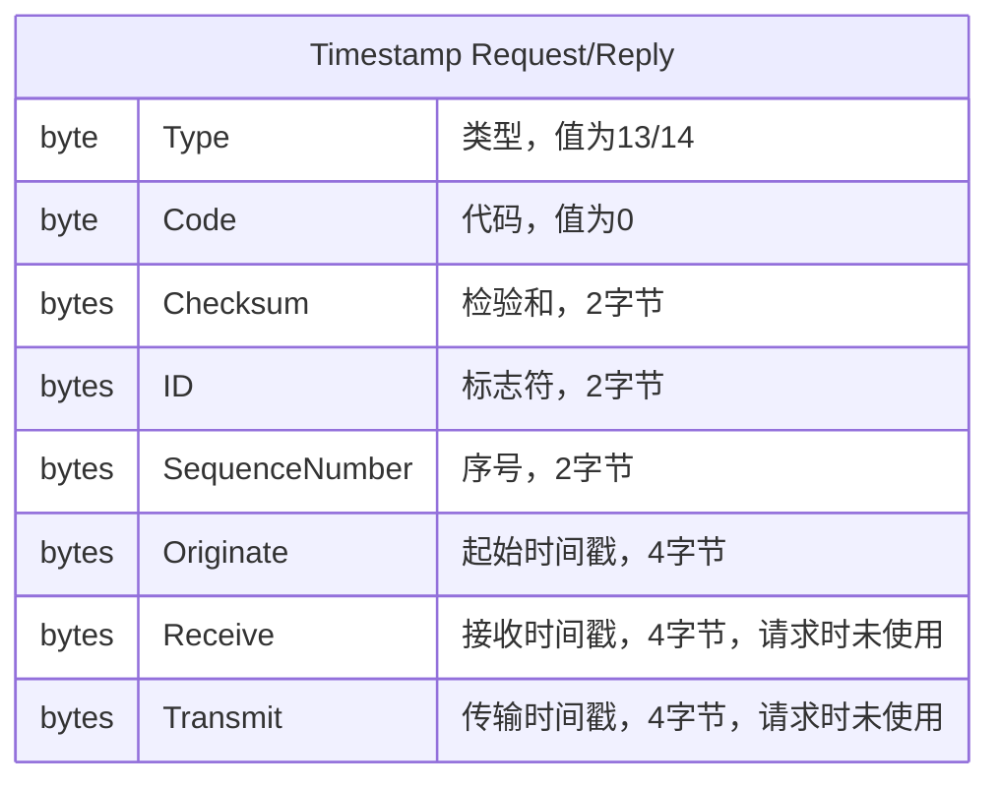

## ICMP协议

当路由器或者目标主机需要通知源主机正在处理的IP数据报存在错误时，它使用互联网控制消息协议(Internet Control Message Protocol, ICMP)。ICMP协议有如下特征：

- ICMP使用IP协议这让ICMP看起来像是IP协议的上层应用协议（ICMP协议消息被封装在IP数据报中）, 然而ICMP协议是IP协议的必须部分并要求所有IP协议实现必须实现ICMP协议
- ICMP被用来报告错误而不是让网络更可靠，数据报仍然可以被发送并且不报告它们丢失的任何错误原因。可靠性需要使用IP协议的上层协议自己实现
- ICMP不能被用来报告ICMP消息的错误，这避免了死循环，ICMP查询消息有其对应的响应消息格式
- IP数据报分段时，ICMP消息只报告第一个分段错误，也就是说ICMP消息不会指向IP数据报分段偏移量不为0的分段
- ICMP消息不会响应目标地址是广播/多播地址的数据报
- ICMP消息不会响应没有唯一来源IP地址的数据报，比如0.0.0.0、回环地址、广播地址或多播地址
- RFC 792陈述ICMP消息`可以(can)`被生成用来报告IP数据报处理错误，实际上所有发生错误时路由器总是生成ICMP消息，目标主机是否生成依赖各个平台实现

### ICMP消息格式

ICMP消息通过IP数据报发出，IP数据报首部中协议编号设置为1（ICMP），服务类型设置为0（普通），ICMP消息格式如下：

ICMP消息Type字段常见取值：

- 0 Echo Reply 回显应答，ping程序使用
- 3 Destination Unreachable 目标地址不可达
- 5 Redirect 重定向
- 8 Echo 请求回显, echo请求
- 9 Router Advertisement 路由器通告
- 10 Router Solicitation 路由器请求
- 11 Time Exceeded ICMP超时
- 12 Parameter Problem 参数问题，错误IP数据报首部
- 13 Timestamp Request 时间戳请求
- 14 Timestamp Reply 时间戳应答
- 17 地址掩码请求 已弃用
- 18 地址掩码应答 已弃用

请求回显和回显应答

发起方初始化ID、序列号和数据字段后把数据报发送给目标主机，目标主机收到后将类型改成回显应答并且把数据报再发送回数据发送方。

主机不可达

Type字段取值必须为3，主机不可达Code有以下取值：

- 0 网络不可达
- 1 主机不可达
- 3 端口不可达
- 4 需要分片但是DF设置成了1
- 5 源路由失败
- 6 目的网络未知
- 7 目的主机未知
- 8 源主机被隔离
- 9 与受到管理禁控的目的网络通信
- 10 与受到管理禁控的目的主机通信
- 11 对于指明的服务类型，网络不可达
- 12 对于指明的服务类型，主机不可达
- 13 出于管理目的禁止通信
- 14 主机越权
- 15 优先权剥夺生效

重定向消息

Type字段值必须为5，Code取值如下：

- 0 针对网络的重定向报文
- 1 针对主机的重定向报文
- 2 针对网络和服务类型的重定向报文
- 3 针对主机和服务类型的重定向报文

当路由器支持路由发现协议时，路由器回定期向配置的子网通告自己的IP地址，通告一般会向整个系统多播地址`224.0.0.1`或者受限广播地址`255.255.255.255`发送。默认行为是每10分钟发送一次通告，消息TTL设置为1800秒。路由器也会响应路由器请求消息。

> 如果IP数据报中存在路由选项，则重定向消息不会被发送，即使有更加优化的路由路径。此外，重定向消息应该仅由路由器发送，目标主机不应该发送重定向消息。

主机也可以主动发送路由器请求消息，路由器请求消息会被向所有路由器多播地址`224.0.0.2`或受限广播地址`255.255.255.255`发送。一般来说，每3秒发送3个路由器请求消息，当主机接收到路由器通告后，就会更新自己的默认路由。

超时消息

超时消息Code有两种取值：

- 0 传输TTL为0超时
- 1 分片重装超时

时间戳请求和应答

时间戳请求和应答主要是用来诊断和测试性能，它并不是为了同步时钟（这里和维基百科所说的不同，不过从实际使用来说，ICMP确实不能高精度的同步时钟）。发送方构造一个ICMP时间戳请求消息，设置其中的起始时间戳，然后把它发出去，接收方填充接收时间和传输时间，把ICMP消息类型改成时间戳应答并且把数据报发回给发送方。如果接收时间和传输时间差异很大的话就会有两个可见的时间差，单位是毫秒，也可以使用非标准时间。

### ICMP应用

1. Ping

    Ping是最简单的TCP/IP应用程序，它发送IP数据报到特定目标地址并测量接收数据时消耗的往返时间RTT（Round Trip Time）, ping这个单词来着使用声纳探测水下物体的操作，也是Packet InterNet Groper的缩写。一般来说，测试主机可达性的第一步就是尝试ping它。随着网络安全措施的不断增强，特定的防火墙可能会禁止ICMP协议，这会导致主机不能ping通但是却还是存在部分端口可以访问。很多资深开发都不了解这个知识点，还停留在用ping程序测试端口是否正常监听，正确的办法是用`nc -zv dst_ip dst_port`。

    比如我们在阿里云安全组上设置了禁止Linux ping程序使用的389端口的访问，ping主机时IP数据报会被阿里云安全组直接丢掉，ping程序会一直等待直到IP数据包超时，一般是4秒。

2. Traceroute

    Traceroute是被用来查明IP数据包传输到目标主机时所经过的路由器信息。Traceroute基于ICMP和UDP协议。它向目标主机发送一个TTL为1的IP数据报，第一个路由器对TTL减1，发现TTL变成了0，就会丢弃数据报并返回ICMP超时消息，因为IP数据报中包含路由器IP地址，所以Traceroute就可以知道第一个路由器IP地址了。Traceroute使用更大的TTL（+1秒）去发送数据报，不断记录路由器信息，直到数据报成功到达目标主机。Traceroute使用UDP来发送数据，Traceroute期望目标主机上没有非标准端口33434到33463的监听，当Traceroute收到ICMP端口不可达消息时，就会认为目标主机已经探测到了。
    
    Traceroute默认只探测30个路由节点。

## 参考

- [互联网控制消息协议](https://zh.wikipedia.org/wiki/%E4%BA%92%E8%81%94%E7%BD%91%E6%8E%A7%E5%88%B6%E6%B6%88%E6%81%AF%E5%8D%8F%E8%AE%AE)
- [Traceroute Program](https://www.websitepulse.com/kb/traceroute_program)