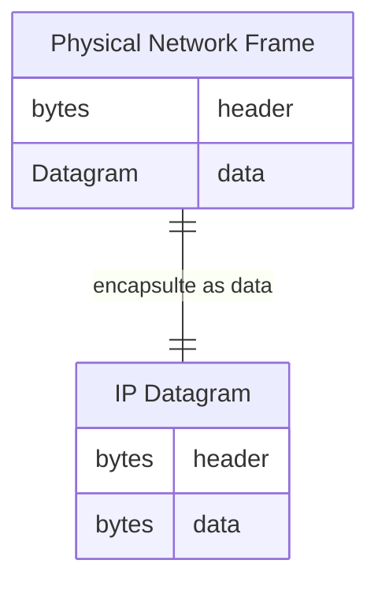
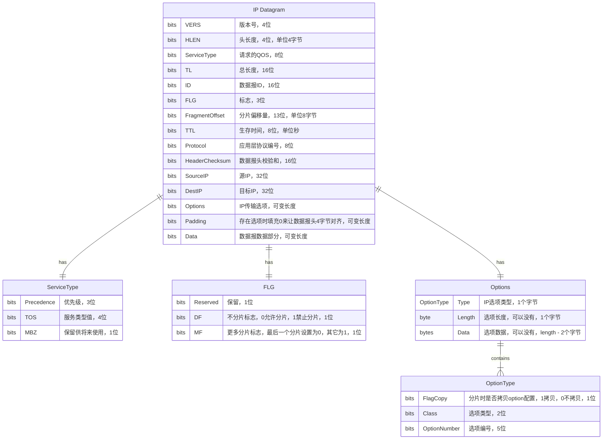

IP网络的数据传输最小单元被称为IP数据报（IP Datagram），它包含IP头和数据两个部分，IP数据报作为数据会被封装进物理网络的帧中。如下面这张ER图所示：

IP协议可以提供分片（fragmentation）和重组（reassembly）的功能。IP数据报最大长度为65535个字节，所有IP主机必须实现不使用分片就能传输576个字节。每个数据报分片都拥有一个头，它是从原始数据报头中拷贝过来的。一个分片数据报被当作普通的IP数据报来处理并发送到目标地址。如果某一个分片丢失了，整个数据报都会被丢弃，因为IP层没有提供确认机制，目标主机会丢掉剩下的已经收到的分片数据报。

## IP数据报格式

IP数据报至少有20个字节的头部，如下面这张ER图所示：

ServiceType中Precedence定义了数据报的优先级，取值如下：

- 000 Routine 普通 表示常规流量
- 001 Priority 优先 表示需要优先处理数据包
- 010 Immediate 立即 需要立即处理的数据包
- 011 Flash 闪电 需要快速传输的数据包
- 100 Flash Override 闪电覆盖 覆盖闪电优先级的数据包
- 101 Critical/ECP 重要/应急控制优先 关键或应急控制流量数据包，优先级非常高 
- 110 Internetwork Control 网络控制 网络间控制信息，优先级极高，通常用于路由协议数据包
- 111 Network Control 网络控制 用于网络间控制的信息，优先级最高，通常用于关键的网络管理和控制数据包

这些优先级允许在网络设备资源优先的情况下，根据数据包的重要性进行流量管理和排队，从而优化网络性能和可靠性。

TOS字段定义服务的值：

- 1000 Minimize delay 最小化延迟
- 0100 Maximize throughput 最大化吞吐
- 0010 Maximize reliability 最大化稳定性
- 0001 Minimize monetary cost 最小货币成本
- 0000 Normal service 普通服务

Fragment Offset字段被用来协助聚合全部数据报，其值表示在前一个分片中数据部分的位置，单位是8字节。比如MTU为1500，要发送2000字节的数据，就会产生两个分片：

- 第一个分片头长度为20字节，数据部分为1480字节，DF=0 表示分片传输，MF=1表示会有更多分片，Offset为0
- 第二个分片头长度为20字节，数据部分为2000-1480=520个字节，DF=0, MF=0表示是最后一个分片，Offset为1480/8=160

Time to Live（TTL）定义数据报被允许在网络上传输的时间，以秒为单位，取值范围为0到255。每个路由器理论上需要把这个值减去它处理数据报的时间，实际上因为每个路由器处理数据报的时间都小于1秒，所以路由器每次都会对TTL值减去1秒，TTL就变成了传输跳数的指标而不是时间指标。当TTL值达到0的时候，路由器就会认为数据报在环路中循环传输并且会丢弃它。ICMP协议的部分工具利用了这个特性，比如ping和traceroute。

Protocol Number（协议编号）表示发送数据报的上层协议，它包括以下取值：

- 0 Reserved 保留
- 1 Internet Control Message Protocol(ICMP)互联网控制消息协议
- 2 Internet Group Managment(IGMP) 互联网组管理协议
- 3 Gateway-to-Gateway Protocol(GGP) 网关对网关协议
- 4 IP(IP encapsulation) IP封装
- 5 Stream 流
- 6 Transmission Control Protocol(TCP) TCP协议
- 8 Exterior Gateway Protocol(EGP) 外部网关协议
- 9 Interior Gateway Protocol(IGP) 内部网关协议
- 17 User Datagram Protocol(UDP) UDP协议
- 41 Simple Internet Protocol(SIP) 简单互联网协议
- 50 Encapsulating Security Payload(ESP) 封装安全载荷，IPSEC协议套件之一
- 51 Authentication Header(AH) 认证头，IPSEC协议套件之一
- 89 Open Shortest Path First(OSPT) IGP 最短路径优先内部网关协议

IP Option有两种格式，两种格式的类型字节格式相同：

- 只有一个类型字节
- 包含一个类型字节，一个长度字节，还有长度-2个数据字节

IP Option中Class取值如下：

- 0 控制
- 1 保留
- 3 调试和测量
- 3 保留

IP Option中选项编号取值如下：

- 0 End of Option， Option结束 fc=0, class=0
- 1 No Operation，没有操作 fc=0, class=0
- 2 Security，安全 fc=1, class=0 数据长度11，数据部分为8字节，这是美国国防部要求的安全信息
- 3 Loose source routing，松散源路由 fc=1, class=0 有变长数据字段
- 4 Internet timestamp 互联网时间戳 fc=0, class=2 有变长数据字段，最大40个字节
- 7 Record route 记录路由 fc=0, class=0 有变长数据字段
- 8 Stream ID 流编号 fc=1, class=0 长度为4，数据字段为一个字节
- 9 Strict source routing 严格源路由 fc=1, class=0 有变长数据字段

Padding的作用是当存在IP Option时，因为数据长度可变，可能会导致IP数据报头不是4字节(32个比特位)的整数倍，所以需要使用Padding来填充0让它满足4字节整数倍。

## IP分段

当IP数据报从一个主机送到另一个主机的时候，它会经过不同的物理网络。每个物理网络都有最大帧限制，叫做Maximum Transmission Unit(MTU)，它限制了可以一个物理帧中可以存放的IP数据报的长度。当数据报文长度超过MTU时进程就要通过创建一系列小于MTU的数据报来分段。接收方聚合产生原始数据报。IP协议要求数据链路层支持最小MTU为68个字节，这是最大IP头60字节和最小数据长度8个字节之和。如果网络的MTU比这个值小，在网卡层必须支持分段和聚合，并且这个过程要对IP层透明。IP协议不要求处理超过576字节的未分段数据报，但是实际上很多实现都支持更大的值。

未分段数据报中的所有分段信息字段值都为0，也就是MF=0, Offset=0。

IP分段步骤如下：

- 检查DF标志，如果为1则不允许分段，丢掉数据报并且返回ICMP错误消息
- 根据MTU值，将数据报中的数据拆分成多个数据部分，除了最后一个部分，其它部分必须是8字节的倍数
- 每个数据部分都放入到IP数据报中，每个数据报的头都从原始数据报中拷贝并做相应的修改：
    - 除了最后一个分段外其它分段MF设置成1
    - 根据分段数据起始字节在原始数据中的位置计算Fragment Offset值，单位是8字节
    - 根据IP Option信息第一个类型字节中fc的值决定是否拷贝原始IP Option信息到分段中
    - 重置IP数据报中的头长度
    - 重置IP数据报中的总长度
    - 重新计算IP数据报的Checksum
- 把所有分段数据报像普通IP数据报一样发送出去，IP层对每个数据报都独立处理，这些分段数据报可以经过不同的路由器到达目的地。通过更小的MTU网络时，它们有可能被继续分段。

在接收端，主机通过IP数据报的ID字段将分段数据报重组成原始数据报。当第一个数据分段到达时接收主机会分配一块缓冲区，接收主机会设置一个定时器，当后续数据报分段到达时，它们的数据将会根据偏移量Offset被拷贝到缓冲区的指定位置，当所有数据分段都到达时，原始未分段数据报就重组成功了。主机会把数据报当作未分段的来交给上层应用程序处理。

如果定时器超时，数据报会被丢弃。定时器初始值为IP数据报中的TTL值。

## IP路由选项

IP数据报选项中提供了两个让数据发送方显式提供路由信息的方法，它也提供了一种让IP数据报获取它经过的路由的方法。

1. Loose Source Routing（LSR 松散源路由）

    允许数据包在通过指定路由器（节点）之间可以经过其他任意的路由器

    适用于希望数据包通过特定的关键节点，但不要求严格的路径控制的场景

2. Strict Source Routing（SSR 严格源路由）

    要求数据包严格按照指定的路由器顺序传输，不允许在指定路由器之间经过其他任何路由器

    适用于对数据包传输路径有严格要求的场景，需要完全按照指定的路由器顺序传输数据

> 这两种源路由技术在一些特定的网络调试、管理和控制场景中可能会用到，但在现代网络中使用较少，特别是在 IPv6 环境中，这些选项已经被弃用。

3. Record Route

    这个选项提供了让IP数据报记录自己经过的路由器的，它提供了一个空的路由数据字段。当数据报经过路由器时，这个字段会被填充，原始数据报必须提供足够的数据空间来记录这些路由信息，如果在到达目的地址前数据字段填满了，后续的路由信息将不会被记录。

## 参考文档

- [IPV4数据报格式](http://www.tcpipguide.com/free/t_IPDatagramGeneralFormat.htm)
- [IPV4服务类型TOS](https://en.wikipedia.org/wiki/Type_of_service)
- ChatGPT