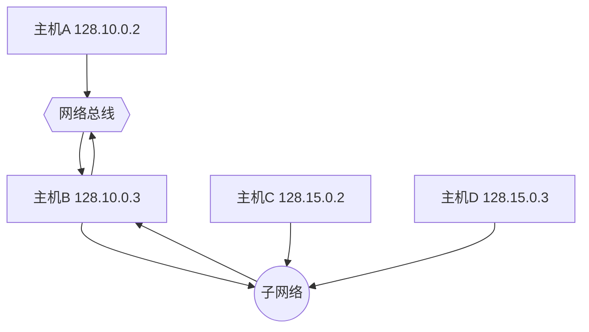
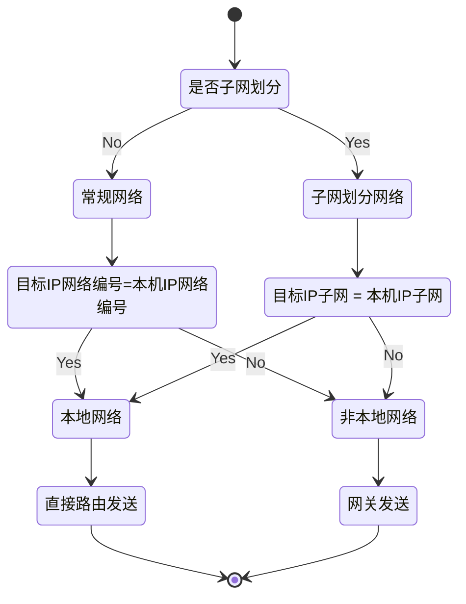

> 本文根据IBM的《TCP/IP Tutorial and Technical Overview》简要摘录IP数据报路由和数据传输方法相关知识

## IP路由

IP层的一个重要功能就是IP路由，它提供了机制让路由器和不同的物理网络进行连接，设备可以同时扮演普通主机和路由器的角色。

路由器拥有四种目标地址的信息：

- 路由器直接连接网络中的主机信息
- 路由器中显示配置的主机或者网络信息
- 路由器接收到ICMP重定向消息的主机或者网络信息
- 一个对所有其它目标地址的默认信息

有两种IP路由类型：

- 直接路由 目标主机和源主机通过物理网络直接相连，可以把IP数据报封装成物理网络的帧直接交换，这里路由其实是数据链路层做的，也叫接口路由
- 间接路由 目标主机和源主机没有通过物理网络直接相连，需要通过一个或者多个IP网关才能联通，源主机仅需要知道第一个IP网关的地址信息即可发送报文给目标主机

> 在TCP/IP协议术语中，`网关`和`路由器`可以交换使用，网关表示一个承担了路由器的职责的系统

直接路由可以用下列方法实现：

- 二层交换机，直接通过MAC地址快速转发数据帧，这是实现直接路由的最常见方式
- 集线器 将收集到的数据帧广播到各个端口，方法低效且容易引起冲突
- 主机用交叉网线直接连接，可以在没有其它设备参与的情况下直接路由

> 交叉网线用于连接相同设备间的连接，一端的1/2号线连接另一端的3/6号线，1/2号线是发送数据，3/6号线是接收数据，现代网络设备支持MDI/MDIX可以自动检测网线，不管是直通网线还是交叉网线都可以正常工作

同一个物理网络中可能划分了多个子网，如果源主机和目标主机在同一个物理网络中的不同子网中，需要使用间接路由来完成这两个主机之间的通信，路由器需要转发不同子网之间的流量。

如图，主机A和主机B通过物理线路直接连接，主机A需要通过B和主机C/D通信。

### IP路由表

每个主机保存了目标IP网络编号和下一跳网关的映射信息，这些信息被保存在一个表中，称为路由表。路由表中有三种类型的映射：

- 连接到本地网络的直接路由信息
- 通过一个或者多个网关可以直达的间接路由信息
- IP地址在上述两种类型路由表中不存时的默认路由信息

上图中主机D的路由表示例如下：

| Dest       | Router   | Interface | Note           |
|------------|----------|-----------|----------------|
| 128.10.0.0 | B        | lan0      | 间接路由 |
| 128.15.0.0 | D        | lan0      | 直接路由   |
| 127.0.0.0  | loopback | loo       | 本机网络     |

### IP路由算法

IP路由算法的核心是要区分目标IP所在网络是否与本机是否直接相连的本地网络，如果本地网络，则使用直接路由，否则通过将IP数据报通过网关发送。

> 子网划分时判断是否是本地网络的运算为：`bitwise_AND(dest ip, subnet mask) = bitwise_AND(my ip, subnet mask)`，也就是IP网络编号和子网编号要相同

子网划分刚提出来时，部分网关可能不支持子网划分，那么会发生如下情况：

- 主机通过网关访问子网内其它主机时将会出现问题，因为网关将看到IP数据报的网络编号和网关自己一样，将会导致数据报不能正常路由
- 主机通过网关访问其它划分了子网的网络将可以正常工作

IP路由不仅网关使用，所有网络中的主机也会使用，这产生了两个要求：

- 所有主机必须支持IP路由算法
- 子网中的所有主机必须拥有相同的子网掩码

如果主机不支持子网划分，那么将会发生以下的情况：主机可以正常和自己子网中的任何机器通信却不能和其它子网中的机器通信，这是因为主机看到网络中的其它主机网络编号都和自己相同，所有IP数据报都通过本地路由发送，而本来那些和其它子网的数据报需要通过网关发送

## 数据传输方法

IP数据报传输存在以下几种方法：

- 单播 Unicast 一对一发送数据报，这是最主要的方式
- 广播 BroadCast 一对多发送数据报，广播地址不能作为源地址，包括两种地址：
    - 受限广播地址：255.255.255.255，它将向当前子网中的所有主机广播，路由器一般不转发此类数据报。除非是BOOTP转发，它主要用于无磁盘工作站访问boot server
    - 直接网络广播地址：主要用于没有子网划分的环境，将IP地址的主机编号部分全部置为1，比如128.2.255.255，它将向网络中的所有主机广播，路由器需要转发这类消息以支持ARP协议
    - 子网广播地址：子网划分环境中将IP地址主机部分置为1，将向特定子网中所有主机广播数据报，需要路由器广播
    - 所有子网广播地址：子网划分环境中将本地部分全部置为1，将向特定网络的所有子网广播，一般用不到
- 多播 使用D类IP地址来选择一些主机进行广播，避免向子网中全部主机进行低效广播，需要网络中的主机监听多播地址
- 任播 网络中有多个主机提供相同的服务，可以提供更快的响应时间和可靠性，可以用在DNS根服务器、CDN以及分布式服务中