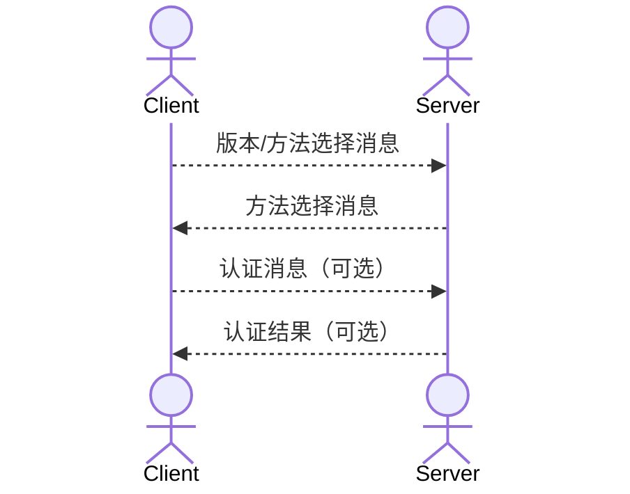

SOCKS5协议是一种网络传输协议，主要用于客户端和外网服务器之间通讯的传递。比如公司的防火墙拒绝客户端直接访问外网，而允许SOCKS5服务器访问，那客户端就可以通过将请求先发送给SOCKS5服务器，
让它代替客户端发送请求并把响应返回给客户端，以达到穿透防火墙的效果。

SOCKS5协议工作在OSI七层模型的会话层，在传输层TCP/UDP协议之上。

# SOCKS5协议处理流程

## 认证方法协商

SOCKS5客户端和服务器建立TCP连接后就开始协商认证方法，流程如下:



客户端版本/方法选择消息格式:

|              |  VER  |  NMETHODS  | METHODS  |
| :----------: | :---: | :--------: | :------: |
|    字节长度   | 1     | 1           | 1-255    |
|   说明        | 版本号，0x05 | 客户端支持的认证方法数量 | 客户端支持的方法，每种方法有单独的一个字节的编码 |

一般常用的两种认证为:

- No Authentication 编码为0x00
- Username and Password Authentication 编码为0x02

服务器响应消息格式:

|   | VER | METHEOD |
| :-: | :-: | :-: |
| 字节长度 | 1 | 1
| 说明 | 版本, 0x05 | 服务器选择的认证方法 |

用户名密码认证时认证消息格式为:

|     |  VER  | ULEN | UNAME | PLEN | PASSWD |
| :-: | :---: | :--: | :---: | :--: | :----: |
| 字节长度 | 1 | 1 | 1-255 | 1 | 1-255 |
| 说明 | 版本，0x01 | 用户名字节长度 | 用户名 | 密码字节长度 | 密码 |

服务器响应结果消息格式:

|   | VER | STATUS |
| :-: | :-: | :-: |
| 字节长度 | 1 | 1
| 说明 | 版本, 0x01 | 认证结果，0x00为成功，其他为失败 |


## 请求协商

客户端和服务器完成认证方法协商之后就会发送请求信息给服务器。消息格式:

| VER | CMD |  RSV  | ATYP | DST.ADDR | DST.PORT |
| :----: | :-----: | :-------: | :------: | :----------: | :----------: |
| 1  |  1  | 0x00 |  1   | Variable |    2     |

CMD有以下三种:

- 0x01 CONNECT 请求连接到某个服务器
- 0x02 BIND 请求绑定服务器，服务器可以指定其他服务器来处理请求，这样可以利用多个服务器
- 0x03 UDP ASSOCIATE

ATYP有三种:

- 0x01 IPV4地址，四个字节表示
- 0x03 FQDN 域名 第一个字节表示域名字节长度
- 0x04 IPV6地址，16个字节

服务器响应格式:

| VER | REP |  RSV  | ATYP | BND.ADDR | BND.PORT |
| :-: | :-: | :---: | :--: | :------: | :------: |
| 1  |  1  | X'00' |  1   | Variable |    2     |

REP中0x00为成功，还有表示错误的其他状态码

## 发送请求

客户端和服务器建立SOCKS5连接之后，客户端就可以发送真实的请求了，比如HTTP请求，SOCKS5服务器要做的就是转发掉TCP请求流和相应流，而不用关心协议的具体内容，因为CONNECT请求会告诉服务器要访问哪个真实的后端服务器。

由此可见，SOCKS5协议比较简单，对转发的内容也不进行加密。


# Lua实现SOCKS5服务器

dispatcher.lua 从luasocket项目samples拷贝的代码，基于coroutine使用完全非阻塞的方式访问socket

```lua
local base = _G
local socket = require("socket")

-- 超时时间
TIMEOUT = 60
ERROR_TIMEOUT = "timeout"

local handlert = {}

-- o(1)复杂度的set
-- table原生方法会导致数据移动
local function newset()
  -- 通过值到下标建立映射关系，可以快速判断值是否存在
  local reverse = {}
  local set = {}

  return base.setmetatable(set, {__index = {
    insert = function(set, value)
      if not reverse[value] then
        table.insert(set, value)
        reverse[value] = #set
      end
    end,
    remove = function(set, value)
      local index = reverse[value]
      if index then
        reverse[value] = nil
        -- 取最后一个元素，放在原有元素位置，防止形成空洞
        local top = table.remove(set)
        if top ~= value then
          reverse[top] = index
          set[index] = top
        end
      end
    end
  }})
end

-- 顺序执行
local function seq_start(self, func)
  return func()
end

function handlert.sequential()
  return {
    tcp = socket.tcp,
    start = seq_start
  }
end


function newhandler(mode)
  mode = mode or "coroutine"
  return handlert[mode]()
end

-- 包装tcp
local function cowrap(dispatcher, tcp, error)
  if not tcp then
    return nil, error
  end

  -- 默认自动用非阻塞方式
  tcp:settimeout(0)
  -- tcp原始metatable
  local metat = {__index = function(table, key)
    table[key] = function(...)
      return tcp[key](tcp, select(2, ...))
    end
    return table[key]
  end}

  local zero = false
  local wrap = {}

  -- 包装tcp settimeout方法
  function wrap:settimeout(value, mode)
    if value == 0 then
      zero = true
    else
      zero = false
    end

    return 1
  end

  -- 包装tcp send方法
  function wrap:send(data, index, last)
    index = (index or 1) - 1
    local result, error
    while true do
      if coroutine.yield(dispatcher.sending, tcp) == ERROR_TIMEOUT then
        print("timeout while sending")
        return nil, ERROR_TIMEOUT
      end
      result, error, index = tcp:send(data, index + 1, last)
      if result ~= ERROR_TIMEOUT then
        return result, error, index
      end
    end
  end

  -- 包装tcp receive
  function wrap:receive(pattern, partial)
    local error = ERROR_TIMEOUT
    local value
    while true do
      if coroutine.yield(dispatcher.receiving, tcp) == ERROR_TIMEOUT then
        return nil, ERROR_TIMEOUT
      end

      value, error, partial = tcp:receive(pattern, partial)
      if (error ~= ERROR_TIMEOUT) or zero then
        return value, error, partial
      end
    end
  end

  -- 包装tcp connect
  function wrap:connect(host, port)
    local result, error = tcp:connect(host, port)
    if error == ERROR_TIMEOUT then
      if coroutine.yield(dispatcher.sending, tcp) == ERROR_TIMEOUT then
        return nil, ERROR_TIMEOUT
      end

      result, error = tcp:connect(host, port)
      if result or error == "already connected" then
        return 1
      else
        return nil, "non-blocking connect failed"
      end
    else
      return result, error
    end
  end

  -- 包装tcp accept
  function wrap:accept()
    while true do
      if coroutine.yield(dispatcher.receiving, tcp) == ERROR_TIMEOUT then
        return nil, ERROR_TIMEOUT
      end

      local client, error = tcp:accept()
      if error ~= ERROR_TIMEOUT then
        return cowrap(dispatcher, client, error)
      end
    end
  end

  -- 包装tcp close
  function wrap:close()
    dispatcher.stamp[tcp] = nil
    dispatcher.sending.conns:remove(tcp)
    dispatcher.sending.routines[tcp] = nil
    dispatcher.receiving.conns:remove(tcp)
    dispatcher.receiving.routines[tcp] = nil

    return tcp:close()
  end

  -- 覆盖部分tcp方法
  return base.setmetatable(wrap, metat)
end

-- dispatcher metatable，只有两个函数
local cometat = { __index = {} }

-- 调度
function schedule(co, status, op, tcp)
  if status then
    if co and op then
      op.conns:insert(tcp)
      op.routines[tcp] = co
      op.stamp[tcp] = socket.gettime()
    end
  else
    base.error(op)
  end
end

-- 剔除
function kick(op, tcp)
  op.routines[tcp] = nil
  op.conns:remove(tcp)
end

-- 唤醒
function wakeup(op, tcp)
  local routine = op.routines[tcp]
  if routine then
    kick(op, tcp)
    return routine, coroutine.resume(routine)
  else
    return nil, true
  end
end

-- 终止
function abort(op, tcp)
  local routine = op.routines[tcp]
  if routine then
    kick(op, tcp)
    coroutine.resume(routine, ERROR_TIMEOUT)
  end
end

-- 事件循环
function cometat.__index:step()
  -- 检查可读可写的连接
  local readable, writable = socket.select(self.receiving.conns, self.sending.conns, 1)
  -- 唤醒读取
  for _, tcp in base.ipairs(readable) do
     schedule(wakeup(self.receiving, tcp))
  end

  -- 唤醒写入
  for _, tcp in base.ipairs(writable) do
    schedule(wakeup(self.sending, tcp))
  end

  -- 检查超时
  local now = socket.gettime()
  for tcp, stamp in base.ipairs(self.stamp) do
    if tcp.class == "tcp{client}" and now - stamp > TIMEOUT then
      abort(self.sending, tcp)
      abort(self.receiving, tcp)
    end
  end
end

function cometat.__index:start(func)
  local routine = coroutine.create(func)
  schedule(routine, coroutine.resume(routine))
end

-- dispatcher
function handlert.coroutine()
  local stamp = {}
  local dispatcher = {
    stamp = stamp,
    sending = {
      name = "sending",
      conns = newset(),
      routines = {},
      stamp = stamp
    },
    receiving = {
      name = "receiving",
      conns = newset(),
      routines = {},
      stamp = stamp
    }
  }
  -- 包装tcp
  function dispatcher.tcp()
    return cowrap(dispatcher, socket.tcp())
  end

  return base.setmetatable(dispatcher, cometat)
end

return newhandler
```

socks5_const.lua 常量定义

```lua
SOCKS_VERSION = 0x05
SOCKS_NMETHODS = 0x01

SOCKS_AUTH_NO_AUTH = 0x00
SOCKS_AUTH_USERNAME_PASSWORD = 0x02
SOCKS_AUTH_NO_ACCEPTABLE_METHOD = 0xff

SOCKS_AUTH_UP_VERSION = 0x01
SOCKS_AUTH_NAME_MIN = 1
SOCKS_AUTH_NAME_MAX = 255
SOCKS_AUTH_PASS_MIN = 1
SOCKS_AUTH_PASS_MAX = 255

SOCKS_AUTH_STATUS_SUCCESS = 0x00
SOCKS_AUTH_STATUS_FAILURE = 0x01

SOCKS_CMD_CONNECT = 0x01
SOCKS_CMD_BIND = 0x02
SOCKS_CMD_UDP = 0x03
SOCKS_RSV = 0x00
SOCKS_ATYP_IPV4 = 0x01
SOCKS_ATYP_DOMAIN = 0x03
SOCKS_ATYP_IPV6 = 0x04

SOCKS_REPS = {
  [0x00] = "succeed",
  [0x01] = "general SOCKS server failure",
  [0x02] = "connection not allowed by ruleset",
  [0x03] = "Network unreachable",
  [0x04] = "Host unreachable",
  [0x05] = "Connection refused",
  [0x06] = "TTL expired",
  [0x07] = "Command not supported",
  [0x08] = "Address type not supported",
}
```

socks5_server.lua

```lua
local newhandler = require("dispatcher")
local handler = newhandler()
require("socks5_const")

local bind_ip = "127.0.0.1"
local bind_port = 1080

local socket = require("socket")

local char = string.char
local byte = string.byte

local check_version = function(acutal, target, msg)
  if acutal ~= target then
    error(msg)
  end
end

local check_username_password_auth = function(client)
  local version = client:receive(1)
  if version ~= char(SOCKS_AUTH_UP_VERSION) then
    error("unsupport username and password subnegotiation version: " .. byte(version))
  end
  local ulen = client:receive(1)
  local username = client:receive(byte(ulen))
  local plen = client:receive(1)
  local password = client:receive(byte(plen))
  if username ~= "will" or password ~= "123" then
    client:send(SOCKS_AUTH_UP_VERSION, SOCKS_AUTH_STATUS_FAILURE)
    error("invalid username and password, username: " .. username .. ", password: " .. password)
  else
    client:send(char(SOCKS_AUTH_UP_VERSION, SOCKS_AUTH_STATUS_SUCCESS))
  end
end

-- 认证协商
local authentication_negotiation = function(client)
  local req = client:receive(2)
  local version = byte(req, 1, 1)

  check_version(version, SOCKS_VERSION, "unsupported socks version: " .. version)

  local nmethods = byte(req, 2, 2)
  if nmethods < 1 or nmethods > 255 then
    error("invalid nmethod found: " .. nmethods)
  end

  local methods = client:receive(nmethods)
  local client_auth_methods = {}
  for i = 1, nmethods, 1 do
    client_auth_methods[string.byte(methods, i, i)] = 1
  end

  local auth_method = nil
  if client_auth_methods[SOCKS_AUTH_USERNAME_PASSWORD] == 1 then
    auth_method = SOCKS_AUTH_USERNAME_PASSWORD
  elseif client_auth_methods[SOCKS_AUTH_NO_AUTH] == 1 then
    auth_method = SOCKS_AUTH_NO_AUTH
  end

  if auth_method == nil then
    client:send(char(SOCKS_VERSION, SOCKS_AUTH_NO_ACCEPTABLE_METHOD))
    error("no acceptable authentication method found")
  end

  client:send(char(SOCKS_VERSION, auth_method))
  -- 处理认证
  if auth_method == SOCKS_AUTH_USERNAME_PASSWORD then
    check_username_password_auth(client)
  end
end

-- 从tcp请求流中拷贝http请求并通过dest发送
local copyHttpStream = function(src, dest)
  local headers = ""
  local body_length = 0
  local closeSrc = false
  repeat
    local header = src:receive("*l")
    headers = headers .. header .. "\r\n"
    local start_index, end_index, content_length = string.find(header, "Content%-Length%:%s(%d+)")
    if start_index then
      body_length = tonumber(content_length)
    end
    local start_index, _ = string.find(header, "Connection%:%sclose")
    if start_index == 1 then
      closeSrc = true
    end
  until header == ""
  local req = headers
  if body_length > 0 then
    local body = src:receive(body_length)
     req = req .. body
  end

  dest:send(req)
  return closeSrc
end

local request_negotiation = function(client)
  -- 确定请求
  local req = client:receive(4)
  local version = byte(req, 1, 1)
  local cmd = byte(req, 2, 2)
  local rev = byte(req, 3, 3)
  local atyp = byte(req, 4, 4)

  check_version(version, SOCKS_VERSION, "unsupported socks version: " .. version)

  if cmd == SOCKS_CMD_CONNECT then
    local target_server = nil
    local target_port = nil
    if atyp == SOCKS_ATYP_IPV4 then
      local ip_bytes = client:receive(4)
      local ip = byte(ip_bytes, 1, 1) .. "." .. byte(ip_bytes, 2, 2) .. "." .. byte(ip_bytes, 3, 3) .. "." .. byte(ip_bytes, 4, 4)
      local port_bytes = client:receive(2)
      local port = (byte(port_bytes, 1, 1) << 8) + byte(port_bytes, 2, 2)
      target_server = ip
      target_port = port
    elseif atyp == SOCKS_ATYP_DOMAIN then
      local domain_length = client:receive(1)
      local domain = client:receive(byte(domain_length))
      local port_bytes = client:receive(2)
      local port = (byte(port_bytes, 1, 1) << 8) + byte(port_bytes, 2, 2)
      target_server = domain
      target_port = port
    end

    -- 响应request请求
    client:send(char(SOCKS_VERSION, 0x00, 0x00, SOCKS_ATYP_IPV4, 0, 0, 0, 0) .. char(math.floor(bind_port >> 8), bind_port%256))

    return target_server, target_port
  end
end

local function move(foo, bar)
  local live
  while 1 do
      local data, error, partial = foo:receive(2048)
      live = data or error == "timeout"
      data = data or partial
      local result, error = bar:send(data)
      if not live or not result then
          foo:close()
          bar:close()
          break
      end
  end
end

local server = assert(handler.tcp())
assert(server:bind("127.0.0.1", 1080))
assert(server:listen(1024))
handler:start(function ()
  while 1 do
    local client = assert(server:accept())
    local ip, port = client:getpeername()
    -- print("receive connection from ip:" .. ip .. ", port: " .. port)
    client:settimeout(0)
    handler:start(function ()
      authentication_negotiation(client)
      local target_server, target_port = request_negotiation(client)
      local peer = assert(handler.tcp())
      assert(peer:settimeout(0))
      assert(peer:connect(target_server, target_port))
      handler:start(function ()
        move(client, peer)
      end)
      move(peer, client)
    end)
  end
end)

while 1 do
  handler:step()
end
```

> 上述代码没有好好处理异常情况，不是很健壮

# 参考

- [SOCKS Protocol Version 5](https://datatracker.ietf.org/doc/html/rfc1928)
- [Username/Password Authentication for SOCKS V5](https://www.rfc-editor.org/rfc/rfc1929)