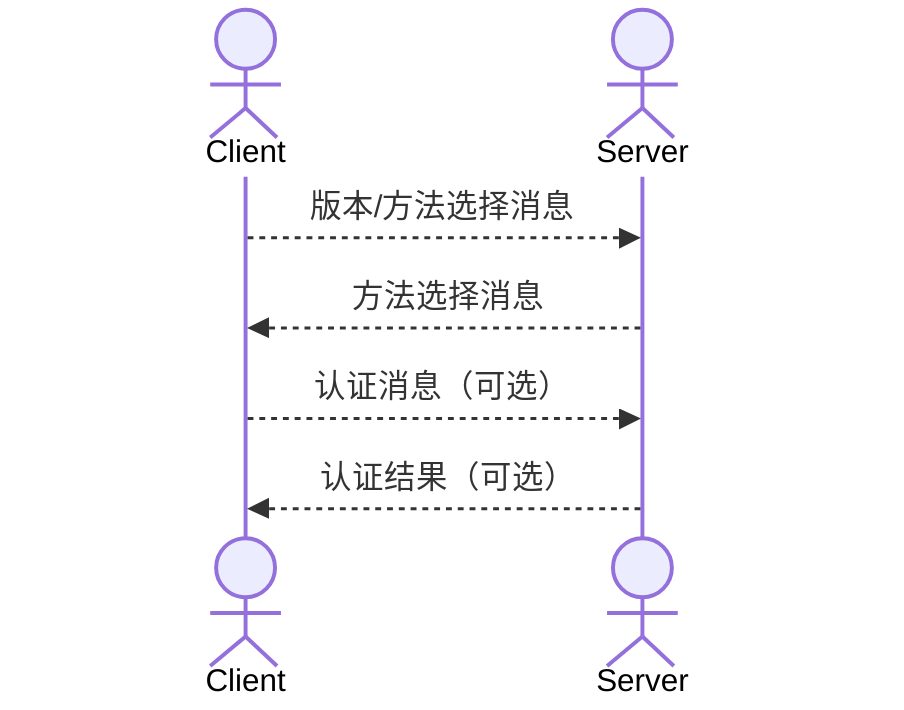
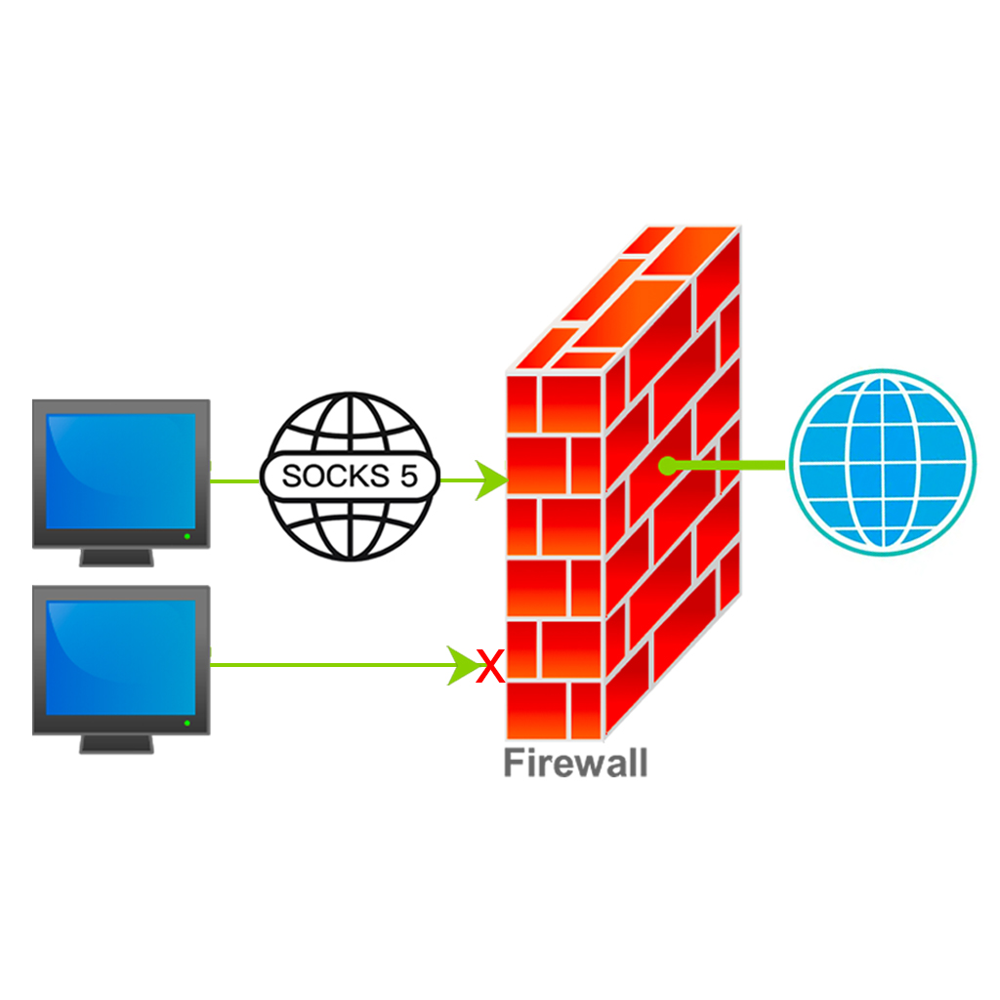

SOCKS5协议是一种网络传输协议，主要用于客户端和外网服务器之间通讯的传递。比如公司的防火墙拒绝客户端直接访问外网，而允许SOCKS5服务器访问，那客户端就可以通过将请求先发送给SOCKS5服务器，
让它代替客户端发送请求并把响应返回给客户端，以达到穿透防火墙的效果。

SOCKS5协议工作在OSI七层模型的会话层，在传输层TCP/UDP协议之上。

# SOCKS5协议处理流程

## 认证方法协商

SOCKS5客户端和服务器建立TCP连接后就开始协商认证方法，流程如下:

客户端版本/方法选择消息格式:

|              |  VER  |  NMETHODS  | METHODS  |
| :----------: | :---: | :--------: | :------: |
|    字节长度   | 1     | 1           | 1-255    |
|   说明        | 版本号，0x05 | 客户端支持的认证方法数量 | 客户端支持的方法，每种方法有单独的一个字节的编码 |

一般常用的两种认证为:

- No Authentication 编码为0x00
- Username and Password Authentication 编码为0x02

服务器响应消息格式:

|   | VER | METHEOD |
| :-: | :-: | :-: |
| 字节长度 | 1 | 1
| 说明 | 版本, 0x05 | 服务器选择的认证方法 |

用户名密码认证时认证消息格式为:

|     |  VER  | ULEN | UNAME | PLEN | PASSWD |
| :-: | :---: | :--: | :---: | :--: | :----: |
| 字节长度 | 1 | 1 | 1-255 | 1 | 1-255 |
| 说明 | 版本，0x01 | 用户名字节长度 | 用户名 | 密码字节长度 | 密码 |

服务器响应结果消息格式:

|   | VER | STATUS |
| :-: | :-: | :-: |
| 字节长度 | 1 | 1
| 说明 | 版本, 0x01 | 认证结果，0x00为成功，其他为失败 |

## 请求协商

客户端和服务器完成认证方法协商之后就会发送请求信息给服务器。消息格式:

| VER | CMD |  RSV  | ATYP | DST.ADDR | DST.PORT |
| :----: | :-----: | :-------: | :------: | :----------: | :----------: |
| 1  |  1  | 0x00 |  1   | Variable |    2     |

CMD有以下三种:

- 0x01 CONNECT 请求连接到某个服务器
- 0x02 BIND 请求绑定服务器，服务器可以指定其他服务器来处理请求，这样可以利用多个服务器
- 0x03 UDP ASSOCIATE

ATYP有三种:

- 0x01 IPV4地址，四个字节表示
- 0x03 FQDN 域名 第一个字节表示域名字节长度
- 0x04 IPV6地址，16个字节

服务器响应格式:

| VER | REP |  RSV  | ATYP | BND.ADDR | BND.PORT |
| :-: | :-: | :---: | :--: | :------: | :------: |
| 1  |  1  | X'00' |  1   | Variable |    2     |

REP中0x00为成功，还有表示错误的其他状态码

## 发送请求

客户端和服务器建立SOCKS5连接之后，客户端就可以发送真实的请求了，比如HTTP请求，SOCKS5服务器要做的就是转发掉TCP请求流和相应流，而不用关心协议的具体内容，因为CONNECT请求会告诉服务器要访问哪个真实的后端服务器。

由此可见，SOCKS5协议比较简单，对转发的内容也不进行加密。

# 参考

- [SOCKS Protocol Version 5](https://datatracker.ietf.org/doc/html/rfc1928)
- [Username/Password Authentication for SOCKS V5](https://www.rfc-editor.org/rfc/rfc1929)