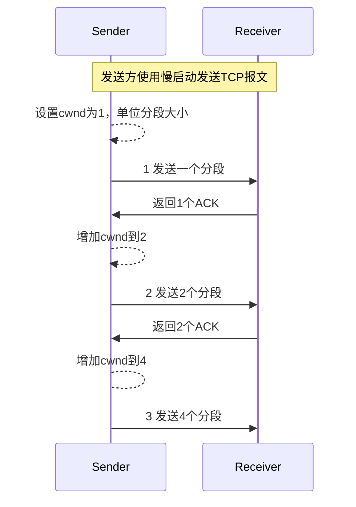
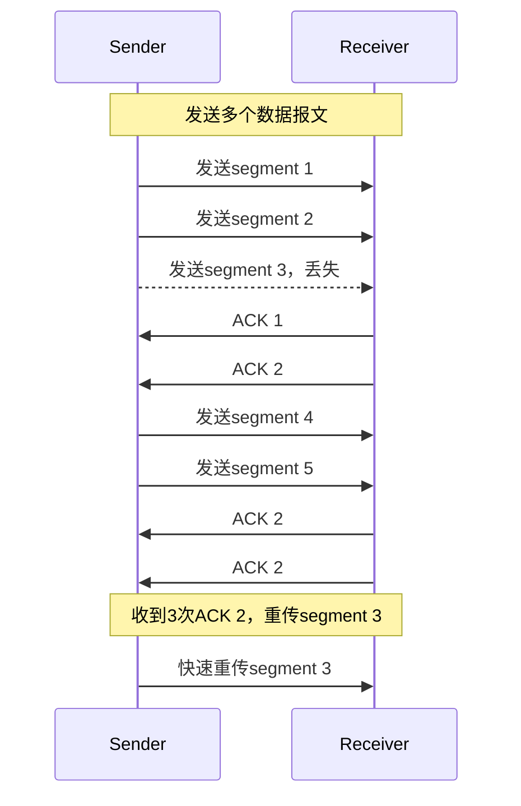

## 概述

TCP协议和UDP协议一个很大的区别就是TCP协议使用拥塞控制算法。TCP拥塞控制算法可以避免过度使用网络容量（比如比较慢的局域网连接）。TCP可以根据网络容量调整发送速率以避免潜在的拥塞情况。TCP协议中已经新增了一些拥塞控制算法，并且这仍然是一个活跃的研究领域，个人认为TCP拥塞控制算法是TCP协议中最复杂的部分。

现代TCP实现主要包括四种基本拥塞控制算法：

- Slow Start 慢启动
- Congestion Avoidance 拥塞避免
- Fast Retransmit 快速重传
- Fast Recovery 快速恢复

## 慢启动

TCP协议老旧的实现会根据接收方建议的窗口大小来发送多个分段，当两个主机在同一个局域网（子网）中这种方法没有什么问题。但是当主机之间存在路由器和更慢的线路时就会出现问题。某些中间路由器的处理能力跟不上发送频率时数据报文就会被丢掉，数据报文会被重传并导致网络性能下降。

慢启动算法可以避免这种情况，它根据ACK确认速率来确定发送方的发送速率。慢启动在TCP发送方新增了一个拥塞窗口（Congestion Window, 简称cwnd）。当主机和另一个网络中的主机建立连接时，拥塞窗口被初始化成1个TCP分段大小（另一方建议的分段大小或者默认值，一般是536或512字节）。

每当发送方收到一个TCP分段的ACK时，拥塞窗口就会被增大一个分段大小。发送方可以传输拥塞窗口和建议窗口的较小值。拥塞窗口是发送方实施的流控措施，建议窗口是接收方实施的流控措施。前者是基于发送方对网络拥塞感知的评估，后者和接收方为当前连接分配的可用缓冲区有关。

发送方开始时发送一个TCP分段并等待ACK，当收到ACK时，拥塞窗口就会从1增加到2，发送方就可以发送两个分段。这两个分段ACK都被收到时，拥塞窗口就会增加到4。这种算法近乎指数增长，虽然不完全是，因为接收方可能会延迟ACK的发送，比如每收到两个分段再发送一个ACK。

在某个时间点，IP网络的容量会被达到（比如较慢的局域网链路），中间路由器会开始丢掉报文，这会提示发送方拥塞窗口已经增长太大了。

慢启动示意图：

## 拥塞避免

拥塞避免假设因为数据报文损坏导致的丢包概率非常小（远小于1%），因此丢包是源端和目标端之间的网络中存在拥塞的信号，丢包有两个症状：

- 数据报文传输发生超时
- 收到重复ACK

拥塞避免和慢启动是不同目标的互相独立算法，然而当拥塞发生时，TCP必须降低向网络中传输数据报文的速率，并且要调用慢启动来继续传输，在实际中这两种算法被一起实现。

拥塞避免和慢启动需要每个连接维护两个变量：

- 拥塞窗口 cwnd
- 慢启动阈值 ssthresh

组合起来的算法处理流程：

- 连接初始化，设置cwnd为一个报文分段大小，ssthresh为65535
- TCP发送方限制发送数据不超过cwnd和接收方建议窗口的较小值，即不超过 min(cwnd, advertised_window)
- 当拥塞发生时（超时或重复ACK），把当前发送窗口的二分之一值存入ssthresh中，如果拥塞原因是超时，把cwnd设置成1个报文分段大小
- 当新数据被另一方收到并确认时则增加cwnd，增加方式则需要根据TCP当前是处于慢启动还是拥塞避免状态。如果cwnd小于等于ssthresh，认为TCP处于慢启动状态，否则认为处于拥塞避免状态。

慢启动进行途中如果发生拥塞，拥塞避免算法就会接管。拥塞避免时每次收到ACK时就增加cwnd值，增加值为`segsize*segsize/cwnd`，segsize是报文分段大小，cwnd是拥塞窗口大小。这种增长是线性增长，慢启动是指数增长。cwnd每次RTT中最多增长一个报文分段大小。

> 因为(segsize < cwnd)，所以 (segsize*segsize/cwnd < segsize)，也就是说cwnd增量小于segsize

## 快速重传

快速重传可以避免TCP一直等到数据报文超时后再重新发送报文。当TCP数据报文出现乱序时，接收方可能会生成中间ACK（重复ACK），重复ACK的目的是让另一方知道数据报文出现乱序并且告知对方己方期待的序列号。

因为TCP不知道重复ACK是由丢包还是乱序导致的，所以它会等待少量重复ACK的到来。如果发生乱序的话，通常会只有1或者2个重复ACK，如果有三个或者更多的重复ACK则认为是丢包的强烈征兆。TCP就会不等待重传计时器超时而立即重传那些看起来丢失的报文。

快速重传示意图如下：

## 快速恢复

当快速重传把看起来丢失的数据报文发出后，就会进行拥塞避免而不是慢启动，这就是快速恢复。它是大窗口、中等拥塞情况下实现高吞吐量的一个办法。

不进行慢启动的原因是在接收到重复ACK不仅仅告诉TCP丢失了一些数据报文，因为重复ACK只有在其它报文被收到时才会被生成，通信两端中仍然有数据流，TCP不想粗暴地通过慢启动来降低速度。快速重传和快速恢复算法通常会被一起实现：

- 当接收到第三个重复ACK时，设置ssthresh为当前拥塞窗口（cwnd）的一半，但是不少于2个报文段大小。重新发送丢失的分段并设置cwnd为`ssthresh + 3*segsize`，这相当于把拥塞窗口设置为`另一方缓存大小+网络中的报文大小`
- 每次收到重复ACK，把cwnd增加1个报文分段大小，这相当于把已经离开网络的数据分段大小增加到拥塞窗口上，如果新拥塞窗口允许的话则发送一个报文分段
- 当下一个确认新数据分段的ACK到达时，把cwnd设置为ssthresh的值（步骤一中保存的值），这个ACK是对步骤一中重传的确认，重传之后经历了1个RTT。此外，这个ACK确认了丢失报文和第一个重复ACK之间的所有报文。这个步骤是拥塞避免，因为TCP发送速率下降为发生丢包时的一半。