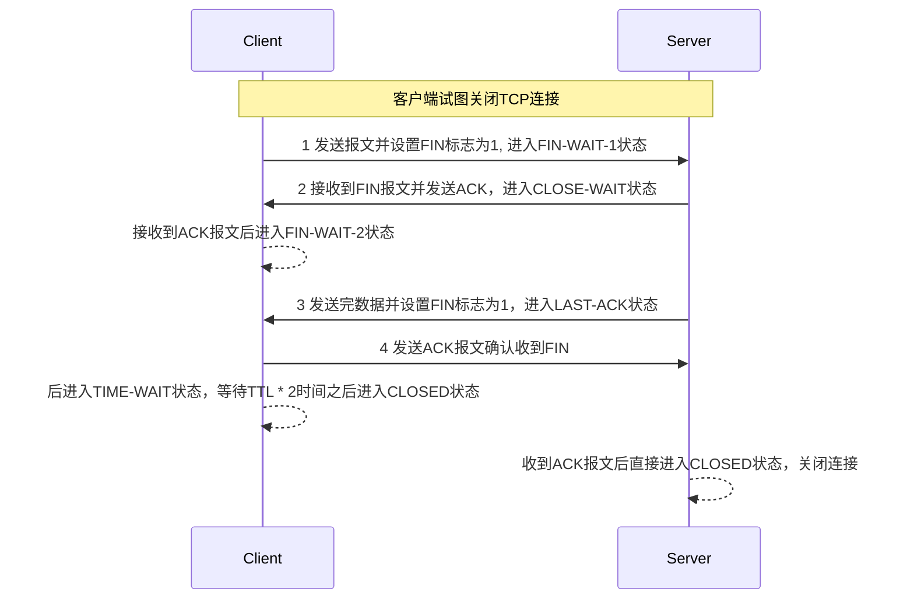

## 三次握手

TCP协议中通信双方（进程）在传输任何数据之前必须建立连接，通常是服务器进程启动一个监听端口（被动打开），客户端进程连接到服务器（主动打开）。服务器进程的被动监听端口会休眠直到下一个客户端试图建立连接。

上图就是有名的三次握手过程，注意握手时TCP分段中包含双方的初始序列号，这些序列号在数据传输时将会被使用。

服务器端执行了Socket API中的`listen`函数后，会在服务器上建立两个队列：

- SYN队列 存放完成两次握手的结果，队列长度由listen函数的参数backlog指定，最大值受/proc/sys/net/ipv4/tcp_max_syn_backlog限制
- ACCEPT队列 存放完成三次握手的结果

> 如果开启了syncookies选项，backlog参数将被忽略，backlog参数还受到/proc/sys/net/core/somaxconn限制，Linux 5.4开始默认4096，之前版本是128

## 四次挥手

TCP通信双方通过在TCP分段中将FIN标志位（表示没有更多数据要发送了）。因为TCP连接时双工的，也就是每个方向上都有一个单独的数据流，FIN分段仅关闭发送方的连接，另一方仍然可以继续传输剩下的数据，在最后一个分段中设置FIN标志位设置为1即可。当通信双方的数据流都关闭后连接状态就会变成删除状态。

在TCP四次挥手过程中，通信双方会会分别发送两个SYN和两个ACK报文，确保双方都关闭了连接，从而保证数据的完整性和连接的正确关闭。

> 在Nginx等支持KeepAlive功能的软件中，服务端的KeepAlive时间需要设置比客户端大，让客户端主动去关闭连接，服务器主动关闭连接容易导致客户端连接池中的连接处于关闭状态而导致客户端异常。

## 参考

- [传输控制协议](https://zh.wikipedia.org/zh-cn/%E4%BC%A0%E8%BE%93%E6%8E%A7%E5%88%B6%E5%8D%8F%E8%AE%AE)
- [listen(2)](https://man7.org/linux/man-pages/man2/listen.2.html)
- [TCP重置攻击](https://zh.wikipedia.org/wiki/TCP%E9%87%8D%E7%BD%AE%E6%94%BB%E5%87%BB)
- ChatGPT