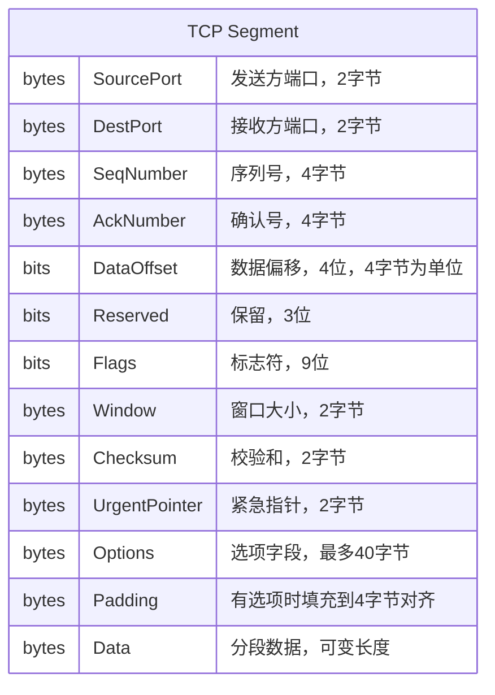
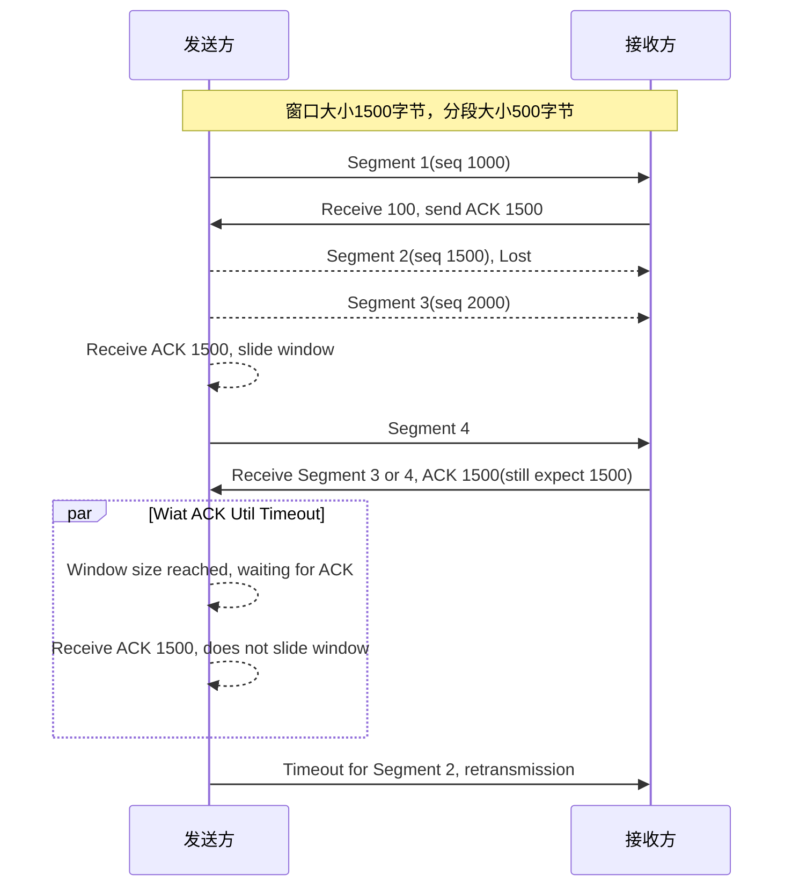

## TCP分段

TCP分段（Segment）格式如下：

SeqNumber: 分段中第一个字节的序列号，如果是SYN分段，序列号就是起始序列号（n），分段第一个字节就是n+1，这也是为啥三次握手时ACK的值是n+1

AckNumber: 如果ACK控制位设置了则此值包含接收方期待收到的下一个字节序列号

DataOffset: 表示数据段的偏移量，单位是4字节，它表示了数据段的开始位置

Flags共有9位，其含义分别如下：

- NS-ECN-nonce ECN显式拥塞通知（Explicit Congestion Notification）
- CWR 拥塞窗口减少
- ECE-ECN-Echo 根据SYN标志位有不同含义
- URG 高优先级数据包标志位，为1的话紧急指针字段有效
- ACK 确认号字段
- PSH 为1表示带有PUSH标志位，指示接收方应该尽快把报文段交给应用层而不用等待缓冲区装满
- RST 为1表示出现严重错误，需要重建TCP连接，也可以用于拒绝非法报文段和拒绝连接请求
- SYN 为1表示是请求连接或者是连接接收请求，用于建立连接和同步序列号
- FIN 为1表示发送方没有数据要传输了，要求释放连接

Window：在ACK报文段中使用，它定义了从AckNumber开始接收方想接收多少个字节

Checksum: 对IP伪首部/TCP首部和TCP数据进行计算得出的校验和，计算时Checksum字段本身当作0来计算

> IP伪首部和UDP协议类似，都是3个字节，分别包含源IP/目的IP/8位0/8位协议/16位长度信息

Urgent Pointer: 紧急指针，指示紧急数据的偏移量，只有在URG标志位为1时才有效

Options: 和IP数据报选项类似，本文仅列举几种重要的类型

- 2 最大报文段长度（Maximum segment size，MSS）建立连接时接收方设置，用于指明自己能处理的最大报文段长度，未指定则任意大小即可
- 3 窗口扩大因子 取值0-14，用来把TCP窗口的值左移的位数，使窗口值翻倍。只能出现在同步报文段中，否则将会被忽略
- 4 SackOK 发送端支持并同意使用SACK (Selective Acknowledgment)选项
- 5 Sack选项 允许接收方通知发送方所有已经接收到的报文段，因此发送方只需要重发丢失的报文段即可。为了防止大量报文丢失导致Sack选项数据太大，只允许报告4个分段区间，Sack选项中也只应该报告最近接收到的数据段信息

## TCP传输

### TCP重传

TCP通过变长分段（Segment）传输数据，序列号是基于字节数量，确认分段（ACK）定义了接收方期待接收的下一个字节序列号。

当分段丢失时，接收方通过ACK来通知所有已经接收好的（可以理解为连续的Segment）分段并且告诉发送方丢失的分段第一个字节序列号。当发送方已经发送了窗口中的所有能发送的字节后会停止发送，当超时时间达到后丢失的分段会被重新发送。

下图是一个窗口大小为1500字节、分段大小为500字节的发送示例图：

这里有一个问题，发送方确实知道segment 2已经丢失或者损坏了（因为它已经发出了却又收到了它的ACK），但是它不知道segment 3和4的接收情况。这时候发送方至少需要重新发送segment 2，它也可以重新发送3和4（因为它们也在发送窗口内），所以可能有如下情况：

- segment 3已经被收到了，但是4的情况不知道，它可能收到了而ACK还没到达，也有可能丢失了
- segment 3丢失了，我们收到的1500的ACK是segment 4的确认分段

每个TCP的实现都可以自由选择对ACK超时的处理方法，可以只重新发送2，但是在第二种情况下，我们会继续等待直到segment 3的达到超时，这种情况下滑动窗口的吞吐量会严重下降。TCP实现也可以选择立即发送所有窗口内的所有分段。

无论哪种情况都不能达到最大吞吐量，因为ACK没有包含第二个确认序列号来指示实际收到的物理帧信息。

### 可变超时间隔

TCP应该实现根据分段往返时间（Roud Trip Time，RTT）动态调整超时时间间隔的算法。为了实现这个功能，TCP需要记录每个分段发出的时间和收到ACK的时间，通过多组RTT时间计算出一个加权平均时间间隔作为下一个分段的超时时间间隔。

这是一个非常重要的功能，因为在IP网络的延迟可能取决于很多因素，比如低速中间节点的负载情况或者中间IP网关的饱和情况。

## 参考

- [传输控制协议](https://zh.wikipedia.org/zh-cn/%E4%BC%A0%E8%BE%93%E6%8E%A7%E5%88%B6%E5%8D%8F%E8%AE%AE)