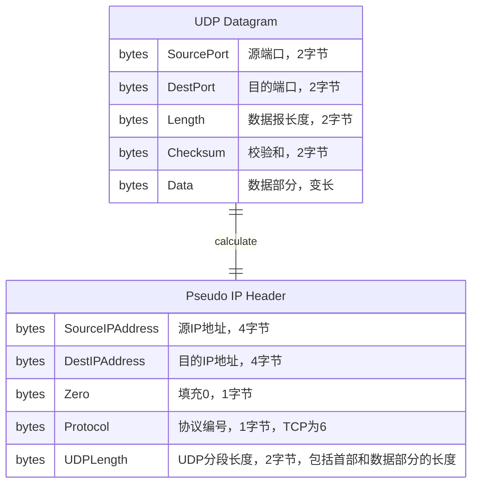

## 端口和套接字

端口（Ports）和套接字（Sockets）是计算机网络中的一个抽象概念，用来为主机和进程间的连接提供统一和唯一标志的方法，无论它们的平台和进程编号。

### 端口

主机上的每个想和其它进程通信的进程需要通过一个或多个端口号向TCP/IP协议套件表明自己的身份。端口使用16个比特位表示（1到65535），被主机对主机的上层协议或者应用程序表示自己将通过此端口发送数据。一般来说有两种端口类型：

- 广为人知的（Well-known）的端口 端口号从1到1023，主要用于服务器，由IANA分配，大部分此类端口只能由系统进程或者超级管理员使用。它们让客户端不需要配置就能寻找到服务器。
- 临时端口 有些客户端连接到服务器的端口不需要使用广为人知的端口，端口信息会被封装在UDP/TCP数据报中发送给服务器，范围从1024到65535。它不需要IANA分配，普通用户可以直接使用它。

### 套接字

套接字接口是通信协议中的一种API接口，它提供了一种通用通信编程接口（socket API），首先在伯克利软件包（Berkeley Software Distribution，BSD）4.2中被提出，尽管没有标准化，伯克利socket API已经成为TCP/IP网络抽象的标准实现。

它包含下面术语：

- socket 一个套接字是一种特殊的文件句柄，进程使用它来向操作系统请求网络服务
- socket address 一个套接字地址是三元组：（协议，本地地址，本地端口），比如（tcp，192.168.1.2，8080）
- conversation 会话是两个进程间的通信连接抽象
- association 关联是定义进程间组成连接的五元组：（协议，本地地址，本地端口，远程地址，远程端口），如（tcp，192.168.1.2，1235，192.168.1.3，8080）
- half-association 半关联定义连接的一端信息，如（协议，本地地址，本地端口）或者（协议，远程地址，远程端口）

## UDP

用户数据报协议（User Datagram Protocol, UDP）基本上是是IP协议的应用层接口，它没有为IP层增加可靠传输、流控或者错误恢复机制。它仅仅是发送和接收数据的复用器和分用器，使用端口来分发数据报给应用程序。UDP为应用程序提供了发送数据报给其它应用程序的机制，UDP层非常薄并且非常高效，然而它需要应用程序去负责错误恢复等功能。

应用程序发送数据报给另一个主机一般需要定义比IP地址更具体的指标，因为数据报一般情况下是发送给特定进程而不是整个系统。UDP协议通过端口号来实现这个功能。

上述UDP数据报格式中，字段含义如下：

- SourcePort 发送进程的端口号，响应也会被发送到这个端口
- DestPort 目标进程的端口号
- Length 用户数据报的长度，包括数据报首部
- Chcecksum 可选字段，通过对伪IP首部、UDP首部和UDP数据部分求和然后取反

> Checksum计算中把伪IP首部计算在内的原因是它可以增强UDP协议的错误检测能力，确保数据在传输过程中的完整性。如果仅计算UDP数据报的Checksum，那网络层和传输层之间错误就没办法检测，因为UDP数据是被封装在IP数据报中传输的。虽然NAT设备会修改掉IP数据报的源IP或者端口，一定程度上减弱UDP Checksum的效果，然而Checksum并不是一种安全机制，它的设计目标是错误检测，而不是防止恶意篡改。

一些使用UDP的应用层协议：

- TFTP 简单文件传输协议
- DNS 域名解析
- LDAP 轻量级目录访问协议

## TCP

TCP为应用程序提供了比UDP协议更多的功能，比如错误恢复、流控和可靠性。TCP协议是面向连接的协议，UDP协议是无连接协议。TCP协议没有假设底层协议（比如IP协议）是可靠的，因此TCP协议需要自己来保证可靠性。TCP协议有如下特点：

- 数据流传输 对应用层来说，TCP传输的是一个连续的字节流，应用层不需要管分段的事情
- 可靠性 TCP为传输的每个字节都分配一个序号并且期待接收方返回一个确认消息（ACK）。如果ACK在超时时间内没有收到，则发送方会重新发送分段。
- 流控 接收方发送ACK消息的时候，同时也给发送方指明它期待接收的下一个字节序号。这个字节序号是它能保证不发生问题的最大字节序号，这种机制也叫做窗口机制。
- 多路复用 和UDP一样使用端口实现多路复用，主要依靠源IP地址和端口号来区分不同客户端，增强了网络吞吐能力
- 逻辑连接 可靠性和流控机制需要TCP为每个数据流初始化和维护特定状态，这些特定状态的组合被称为逻辑连接，逻辑连接由发送和接收套接字唯一确定
- 全双工 TCP可以在发送和接收两个方向上提供并发数据流传输的能力，因为发送双发的分段序号分别设置，互不干扰，所以可以同时发送数据给对方并确认对方的数据

> 个人认为，面向连接和无连接的核心区别在于面向连接需要传输双方维护数据流的状态信息，连接就是状态的逻辑抽象而已

使用TCP的一些常用应用层协议：

- FTP
- Telnet
- HTTP