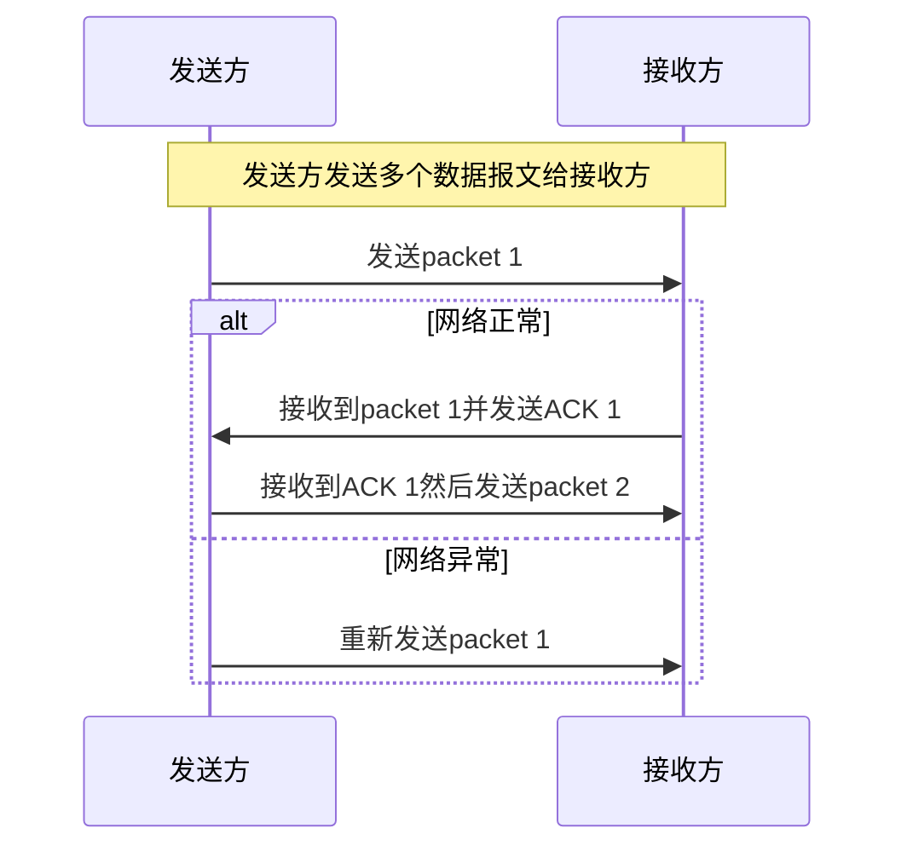
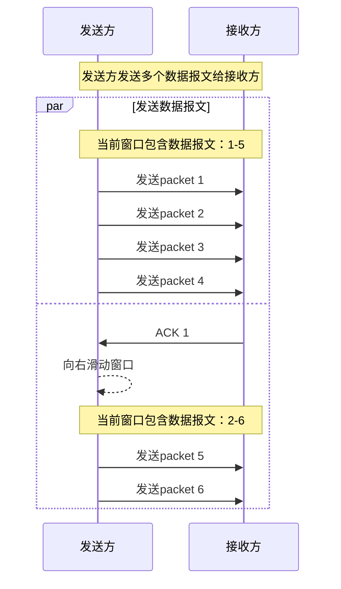

## 最简单的传输方法

每次发送一个报文然后开始等待接收方的确认报文，收到接收方的确认报文之后再发送下一个报文，如果在超时时间内没有收到确认报文，则重新发送报文。

虽然这种方法可以保证可靠传输，但是很明显它的效率太低了，只能利用一部分可用网络带宽。

## 发送窗口

窗口传输可以让发送方在没有收到ACK的情况下一次性发送窗口内的所有数据报文，发送方必须为每个数据报文设置一个计时器。接收方必须对每个收到的数据报文进行确认并发送ACK报文报告最后一个完整接收的报文。假设窗口大小为5个数据报文，则发送流程如下图所示：

有一些特殊的场景：

- packet 2丢失 发送方没收到ACK 2，窗口会一直卡住，最终会超时重发。在接收方，因为没有收到packet 2，虽然接收方收到了packet 3/4/5，它还是会ACK 1，因为1是它收到的最后一个连续的报文。当重传的packet 2被接收方收到之后，接收方会ACK 5，因为现在接收方接收到了1-5所有的数据报文
- packet 2收到了，但是ACK 2丢失了，而ACK 3成功收到，ACK 3的收到表明1-3三个数据报都被接收方收到了，所以发送方会把窗口滑动到packet 4

窗口机制的作用：

- 可靠传输
- 更好地利用网络带宽，更大的吞吐
- 流量控制 接收方可以延迟回应ACK消息

## TCP发送窗口

TCP发送窗口和上述窗口类似而又有所不同：

- TCP使用字节流连接，流中每个字节都被分配了序列号，TCP把连续字节流分成段来传输。发送窗口是字节层级的，数据段和ACK中的序列号表示意思是字节而不是数据报文编号
- 发送窗口大小是由建立连接时接收方决定的并且可以在数据传输过程中变动，每个ACK消息中都会包含特定时间接收方可以处理的窗口大小

TCP数据段中的数据根据和窗口的关系可以分为四类：

- 已经发送并且被确认的
- 已经发出还未被确认的
- 可以被发出而不用等待任何确认的
- 尚不可被发送的

TCP会把字节流分拆成段传输，TCP段中的序列号是段中第一个字节的序列号。