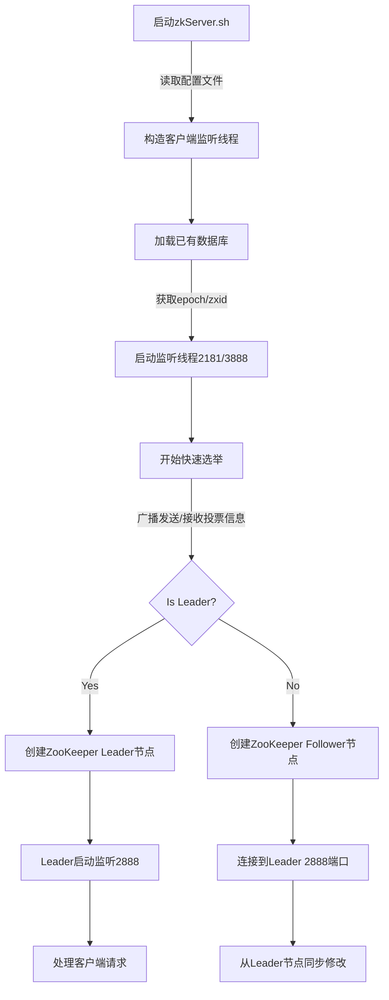
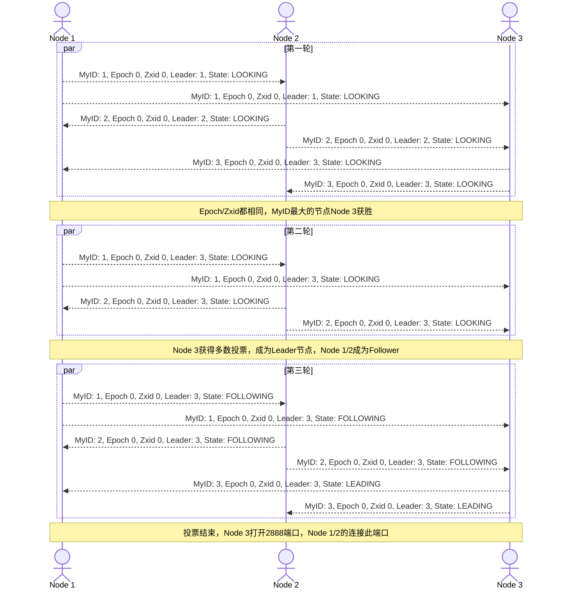
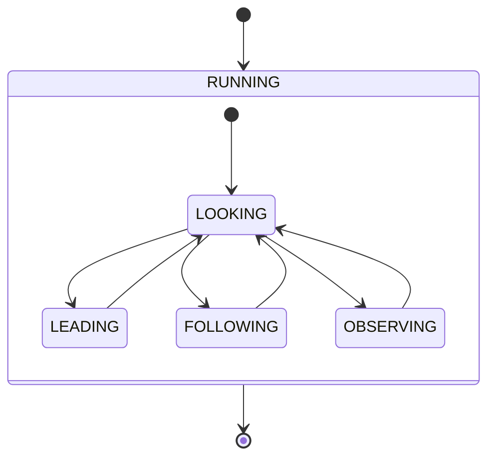

> 因为公司的ZooKeeper当年部署方式不当，导致运行两三年之后经常出现问题，所以最近稍微看了一下ZooKeeper源代码，理解了一下ZooKeeper启动流程，故作此文以志之。

## 端口介绍

ZooKeeper默认使用以下三个TCP端口：

- 2181 用于接受客户端连接和读写请求
- 2888 用于数据同步通信，只有Leader节点监听，Follower连接此端口接受通知
- 3888 用于投票选举通信端口

## 重要概念

ZooKeeper系统中有几个比较重要的数字:

- epoch 选举的代数，每次选举成功后会自动加1，此指也是选举判断Leader节点的一个首要依据
- zxid 事务ID，64位，前32位为Epoch，后32位为自增事物ID，此指也是选举时使用的一个重要依据
- myid 节点ID，标志ZooKeeper身份，此值在集群第一次启动时也会作为选举依据，值大的节点优先

## 启动流程

ZooKeeper以集群方式部署时启动流程如下（部分不涉及主流程的线程图中忽略）

## 选举算法

ZooKeeper从磁盘文件中读取myid/epoch/zxid，使用FastLeaderElection算法进行投票选举，两个节点之间判断依据如下：

- epoch值大的节点获胜
- epoch相同，最新zxid值大的节点获胜
- epoch/zxid相同，节点ID值大的节点获胜

ZooKeeper集群第一次部署时，epoch和zxid都是0，下图描述了第一次集群选举过程

## 状态变化

当ZooKeeper集群结束选举之后，各个节点进入对应的LEADING/FOLLOWING/OBSERVING状态并创建对应的ZooKeeper，集群进入稳定状态，节点开始处理客户端读写请求，如果发生异常情况，节点将会请求新一轮投票，
其状态变化如下图所示

> 一般来说当Follower节点同步Leader节点失败的时候会触发新一轮投票，比如读写超时